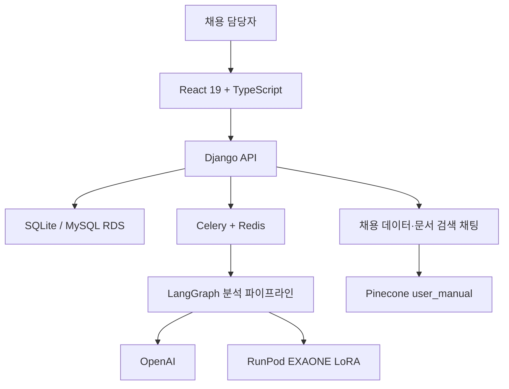

# HumouR

> LangGraph 기반 다단계 지원자 분석과 안전한 채용 데이터 관리를 결합한 AI HR 채용 보조 시스템

HumouR는 HR 전담 인력이 부족한 조직이 **회사 정보 → JD → 평가 체크리스트 → 지원서 → 분석 리포트 → 면접 질문**을 하나의 흐름에서 관리하도록 돕습니다. AI가 합격 여부를 대신 결정하는 대신, 채용 담당자가 검토할 근거와 추가 확인 질문을 구조화해 제공합니다.

이 프로젝트는 단순 LLM 호출을 넘어 입력 보호, 단계별 구조화 출력, 품질 재검증, 비동기 작업, 실패 복구까지 포함한 운영형 AI 파이프라인을 구현하는 데 초점을 두었습니다.

## 핵심 기술 차별점

### 1. 다단계 AI 분석 파이프라인

지원서 분석은 `backend/common/analysis_graph.py`의 LangGraph 그래프로 실행됩니다.


- `analysis_agent.py`: Pydantic 구조화 출력으로 적합도, 면접 질문, 최종 리포트 생성
- `feedback_graph.py`: 원본 근거와 생성 결과를 비교하고 불안정한 결과를 최대 3회 보정
- `masking.py`: 사람·회사·학교·프로젝트 등 식별 정보를 일관된 토큰으로 치환
- `star_analysis.py`: 자기소개서 경험을 Situation·Task·Action·Result로 구조화하되 원문 품질을 함께 보존
- `analysis_prompt.py`: 프롬프트와 평가 기준을 분리하고 분석 버전을 결과에 기록

### 2. OpenAI와 자체 모델 실행 경로

분석·검증에는 OpenAI 모델을 사용하며, 마스킹과 STAR 구조화는 RunPod의 EXAONE LoRA 모델을 선택적으로 사용할 수 있습니다.

- RunPod endpoint가 설정되면 serverless 모델 호출
- endpoint가 없거나 호출에 실패하면 OpenAI 경로로 fallback
- 학습 노트북은 `llm/train_star_masking/`, 평가 자산은 `llm/eval/`에 분리
- RunPod handler와 컨테이너 정의는 `runpod/`에서 관리

### 3. 비동기 처리와 실패 복구

- 분석 요청 즉시 `AnalysisReport(status="onqueue")` 생성
- Celery worker가 있으면 큐에서 처리하고, 없으면 동기 fallback 실행
- `onqueue → processing → done` 또는 `fail` 상태 추적
- 분석 비용을 계정 또는 API Key 크레딧에서 원자적으로 차감
- 처리 실패 시 차감한 크레딧 자동 환불
- JD 체크리스트 생성도 동일하게 상태를 추적하고 재시도 가능한 실패 상태 제공

근거 코드: `backend/api/tasks.py`, `backend/api/views/resume_endpoints.py`, `backend/api/views/job_description_endpoints.py`

## 프론트엔드 안정성과 보안 설계

HumouR 프론트엔드는 화면 구현뿐 아니라 인증 만료, 잘못된 API 응답, 중복 요청과 오래된 응답 같은 실제 운영 문제를 방어합니다.

| 영역 | 구현 내용 |
| --- | --- |
| 세션·CSRF | `withCredentials`로 세션 쿠키를 전달하고 POST 요청 전 CSRF 쿠키를 확보해 `X-CSRFToken` 전송 |
| API Key 격리 | API Key는 필요한 공유 요청에만 명시적으로 `X-API-Key`로 전달하며 URL에 저장하지 않음 |
| 응답 계약 검증 | Zod 스키마로 Account, JD, Resume, Report 등 백엔드 응답을 런타임 검증 |
| 인증 만료 복구 | 세션 만료를 전역에서 감지하고 진행 중 인증 요청을 취소한 뒤 캐시·화면 상태를 정리 |
| 요청 경합 방지 | `AbortController`와 request id로 JD 채팅·공유 리포트의 이전 요청과 stale response 차단 |
| 캐시 일관성 | TanStack Query key를 세션/API Key 모드별로 분리하고 mutation 후 관련 데이터를 무효화 |
| 장애 격리 | 최상위 `AppErrorBoundary`로 예기치 않은 렌더링 오류를 포착하고 안전한 복구 UI 제공 |
| 접근성·반응형 | 시맨틱 상태 영역, 키보드 접근, axe 기반 인증 화면 검사, 모바일·고정 viewport 검증 |

주요 구현: `frontend/src/api/httpClient.ts`, `frontend/src/api/backendSchemas.ts`, `frontend/src/hooks/useAuthExpiryHandler.ts`, `frontend/src/components/common/AppErrorBoundary.tsx`

> 이 구현은 보안 인증 획득을 의미하지 않습니다. 애플리케이션 수준에서 확인 가능한 인증·권한·입력 계약·요청 수명주기 방어를 적용한 것입니다.

## 주요 기능

| 도메인 | 구현 기능 |
| --- | --- |
| 계정 | 회원가입, 로그인, 비밀번호 복구, 프로필·보안 설정, 계정 삭제 |
| 회사 정보 | 회사명, 규모, 팀 구성, 회사 소개, 선호 인재상 관리 |
| JD | 등록·수정·삭제, 채용 상태, AI 체크리스트 생성, 대화형 누락 필드 작성 보조 |
| 지원서 | JD별 지원서 등록·수정·삭제, 구조화된 경력·역량·자기소개서 관리 |
| AI 분석 | 체크리스트 충족 여부, 종합 등급, 역량·적합도·강점·우려점·확인 포인트 생성 |
| 면접 지원 | 지원자 근거 기반 질문, 예상 답변, 질문 의도 생성 |
| 리포트 검토 | 분석 버전, 사용자 평가, 검토 메모, 지원자 검토 상태 저장 |
| 문서 채팅 | 채용 데이터 검색과 Pinecone 사용 설명서 RAG를 결합한 질의응답 |
| 외부 공유 | 허용된 지원서만 API Key로 조회하는 비로그인 리포트·채팅 화면 |
| 운영 | API Key 발급, 키 마스킹 조회, 지원서 권한과 크레딧 한도 관리 |

## 시스템 구성



## 기술 스택

| 구분 | 기술 |
| --- | --- |
| Frontend | React 19, TypeScript 5.9, Vite 7, React Router 7, Ant Design 6, TanStack Query 5, Axios, Zod, ECharts |
| Backend | Python, Django 6, Django ORM, Gunicorn, Celery, Redis |
| AI | LangGraph, LangChain, OpenAI `gpt-4o-mini`·`gpt-4.1`, Pydantic structured output |
| Custom Model | EXAONE LoRA, RunPod Serverless, Hugging Face 기반 학습·추론 자산 |
| RAG | OpenAI `text-embedding-3-small`, Pinecone `user_manual` namespace |
| Database | SQLite(local), MySQL/RDS(remote) |
| Test | Vitest 4, Testing Library, MSW, Playwright, axe-core |
| Deployment | GitHub Actions, AWS S3, SSM, EC2, Nginx, systemd |

## 프로젝트 구조

```text
Final_project/
├── backend/
│   ├── api/                    # 모델, API endpoint, Celery task, migration
│   ├── common/                 # 분석·채팅·체크리스트 LangGraph와 agent/prompt
│   └── config/                 # Django, DB, CORS/CSRF, Celery 설정
├── frontend/
│   ├── src/api/                # HTTP client, Zod schema, API adapter, query 설정
│   ├── src/components/         # 도메인·레이아웃·공통 UI
│   ├── src/hooks/              # 인증, 페이지 상태, query/mutation hook
│   ├── src/pages/              # 인증·대시보드·JD·지원서·리포트·공유 화면
│   ├── scripts/                # API 계약과 주요 사용자 흐름 검증
│   └── tests/e2e/              # Playwright 접근성 E2E
├── database/                   # 채용 데이터 크롤링, 임베딩, Pinecone 업로드
├── llm/                        # 마스킹·STAR 학습 및 모델/RAG 평가 노트북
├── runpod/                     # 마스킹·STAR serverless handler와 docker 정의
├── docs/                       # 코드 기준 위키형 프로젝트 문서
├── outputs/                    # 인터페이스 정의서 산출물
├── .deploy/                    # Nginx·Gunicorn·Celery 운영 설정
└── .github/workflows/          # S3·SSM 기반 EC2 배포 자동화
```

## 로컬 실행

### Backend

```bash
python -m venv backend/.venv
# Windows
backend\.venv\Scripts\activate
pip install -r backend/requirements.txt
cd backend
python manage.py migrate
python manage.py runserver 127.0.0.1:8000
```

`backend/.env`에 최소 `OPENAI_API_KEY`를 설정합니다. 기능에 따라 다음 값을 추가합니다.

```dotenv
OPENAI_API_KEY=...
PINECONE_API_KEY=...
PINECONE_HOST=...
RUNPOD_API_KEY=...
RUNPOD_MASKING_ENDPOINT_ID=...
RUNPOD_STAR_ENDPOINT_ID=...
```

RunPod와 Pinecone 값은 해당 실행 경로를 사용할 때만 필요합니다. 원격 환경은 `IS_REMOTE_HOST`와 `RDS_HOSTNAME`, `RDS_PORT`, `RDS_USERNAME`, `RDS_PASSWORD`, `RDS_DB_NAME`을 사용합니다.

### Frontend

```bash
cd frontend
npm ci
npm run dev
```

Vite는 기본적으로 `127.0.0.1:5173`에서 실행되며 `/api` 요청을 `127.0.0.1:8000`으로 프록시합니다.

## 검증

```bash
cd frontend
npm run lint
npm run test
npm run build
npm run test:e2e
```

단위·통합 테스트는 Vitest, Testing Library, MSW를 사용합니다. Playwright E2E는 인증 화면의 반응형 동작과 axe 접근성 규칙을 검증하며, `frontend/scripts/`에는 백엔드 계약과 주요 화면 흐름을 확인하는 별도 검증 스크립트가 있습니다.

## 상세 문서

- [문서 허브](docs/README.md)
- [프로젝트 개요](docs/00-overview/project-overview.md)
- [시스템 아키텍처](docs/02-architecture/system-architecture.md)
- [프론트엔드 구조](docs/03-frontend/overview.md)
- [백엔드 분석 파이프라인](docs/04-backend/analysis-pipeline.md)
- [API 레퍼런스](docs/06-api/api-reference.md)
- [AI 모델 파이프라인](docs/07-ai-modeling/model-pipeline.md)
- [배포 구조](docs/09-deployment/deployment.md)

## 책임 있는 사용

HumouR의 분석 결과는 지원자의 합격·불합격을 자동 결정하기 위한 것이 아닙니다. 생성 결과는 입력 데이터와 모델 응답에 영향을 받으므로 채용 담당자가 원문 근거, 리포트 버전, 확인 포인트를 함께 검토해야 합니다.
