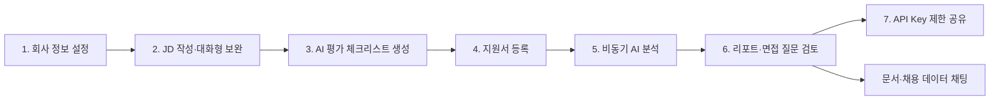
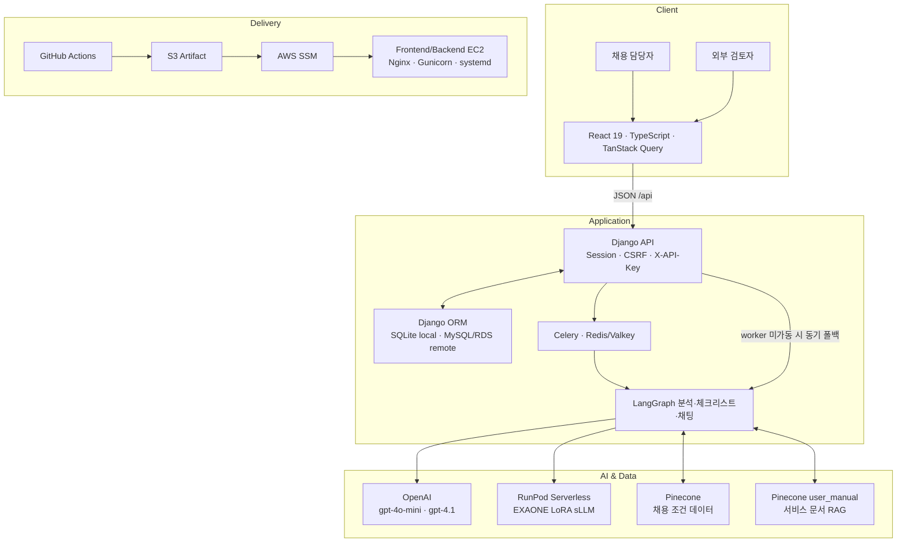
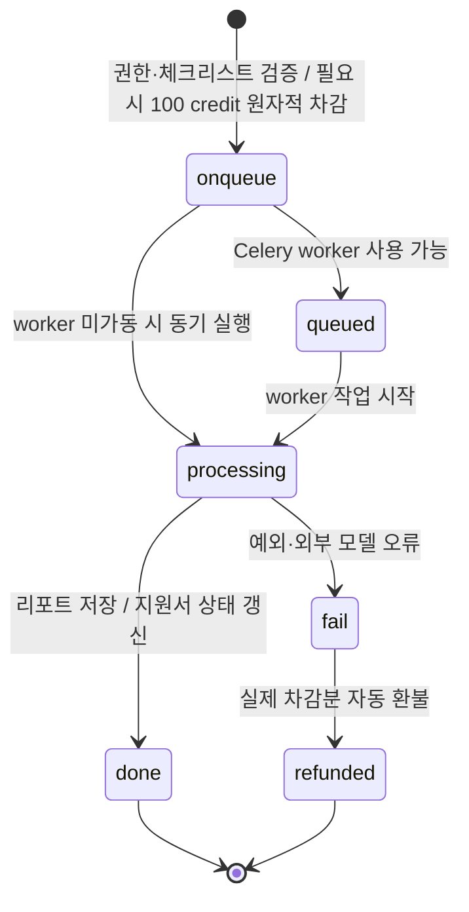
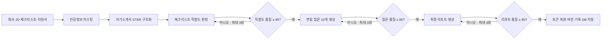
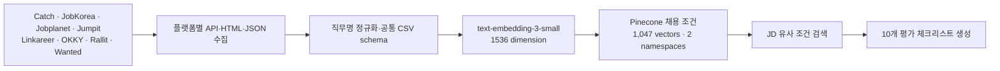
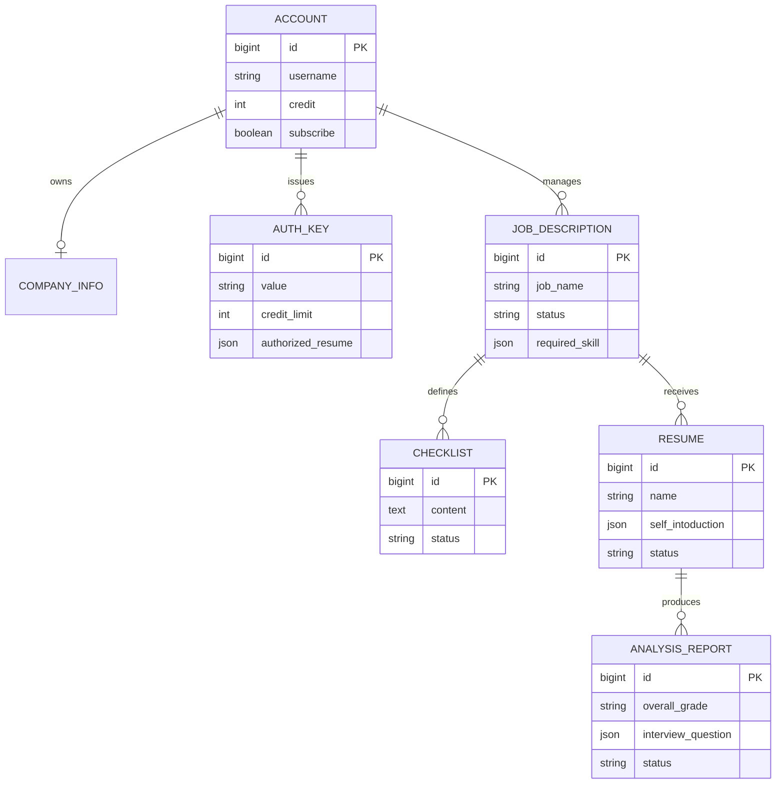

# HumouR

<div align="center">
  <picture>
    <source media="(prefers-color-scheme: dark)" srcset="frontend/public/assets/humour-logo-dark.png">
    <source media="(prefers-color-scheme: light)" srcset="frontend/public/assets/humour-logo-light.png">
    
  </picture>

  <p><strong>채용 공고 작성부터 지원자 분석, 면접 질문, 제한 공유까지 연결한 운영형 AI HR 채용 보조 서비스</strong></p>

  <p>
    
    
    
    
    
  </p>
</div>

> **HumouR**는 HR 전담 인력이 부족한 조직이 회사 정보, JD, 평가 기준, 지원서, 분석 리포트, 면접 질문을 한곳에서 관리하도록 돕습니다. AI가 합격 여부를 대신 결정하는 것이 아니라, 채용 담당자가 **원문 근거와 추가 확인 질문을 바탕으로 일관된 판단**을 내릴 수 있도록 지원합니다.

## 한눈에 보는 프로젝트

| 평가 포인트 | 구현 내용 | 확인 근거 |
| --- | --- | --- |
| **완결된 서비스 흐름** | 회사 설정 → JD 작성 → 평가 체크리스트 → 지원서 → AI 분석 → 리포트·면접 질문 → 외부 공유 | `frontend/src/pages/`, `backend/api/views/` |
| **운영형 AI 파이프라인** | LangGraph 단계 분리, 품질 피드백 루프, Celery 비동기 처리, 동기 폴백, 상태 추적, 실패 환불 | `backend/common/`, `backend/api/tasks.py` |
| **자체 파인튜닝 sLLM** | EXAONE 2.4B 기반 개인정보 마스킹·STAR LoRA 모델, RunPod Serverless 추론 | `llm/train_star_masking/`, `runpod/` |
| **데이터 기반 평가 기준** | 8개 채용 플랫폼 수집기, 표준화·임베딩·Pinecone 검색으로 JD 체크리스트 보강 | `database/` |
| **서비스 안정성** | 세션·CSRF·API Key 권한, Zod 응답 검증, stale response 차단, 원자적 크레딧 처리 | `frontend/src/api/`, `backend/api/views/` |
| **검증 가능한 산출물** | 프론트엔드 테스트 파일 53개, 사용자 흐름 검증 스크립트 16개, 인터페이스 정의서·운영 문서 | `frontend/`, `outputs/`, `docs/` |

### 핵심 성과

- 단순 LLM 호출 화면이 아니라 **데이터 입력, 분석 대기, 실패 복구, 검토, 제한 공유**까지 하나의 제품 흐름으로 구현했습니다.
- 마스킹 모델의 오프라인 F1을 **0.3937 → 0.9518**, STAR 구조화 semantic similarity를 **0.5418 → 0.9296**으로 개선했습니다.
- 분석 품질을 단계별로 재검증하고 기준 미달 결과를 최대 3회 보정하는 **feedback loop**를 적용했습니다.
- 세션 사용자와 외부 API Key 사용자의 데이터·캐시·라우트 권한을 분리했습니다.
- 평가 결과뿐 아니라 정보 손실, 프롬프트 버전 민감도, 소표본 한계도 함께 공개합니다.

## 문제 정의와 해결 전략

### 문제

중소 규모 조직의 채용 과정은 다음과 같은 문제를 반복해서 겪습니다.

- JD와 실제 평가 기준이 분리되어 평가자마다 판단 기준이 달라집니다.
- 많은 지원서를 읽고 핵심 근거와 후속 질문을 정리하는 데 시간이 오래 걸립니다.
- 범용 LLM에 지원자 정보를 그대로 전달하면 개인정보 노출 위험이 커집니다.
- 한 번의 생성 결과를 그대로 사용하면 근거 누락과 출력 형식 불안정성을 통제하기 어렵습니다.
- 분석 실패, 중복 요청, 권한 없는 공유 등 제품 운영 단계의 예외 처리가 필요합니다.

### 해결 전략

HumouR는 채용 담당자의 업무 단위를 하나의 데이터 흐름으로 연결하고, AI 분석을 작은 단계로 나눠 각 결과를 다시 검증합니다.

1. 회사와 JD를 구조화해 평가의 전제 조건을 고정합니다.
2. 외부 채용 데이터 검색 결과로 직무별 체크리스트를 보강합니다.
3. 지원자 식별 정보를 마스킹하고 자기소개서를 STAR 형식으로 구조화합니다.
4. 체크리스트 적합도, 근거, 우려점, 확인 포인트와 면접 질문 10개를 생성합니다.
5. 생성 결과를 점수화해 기준 미달이면 재생성하고, 최종 결과와 분석 버전을 저장합니다.
6. 담당자가 결과를 검토·평가하고 필요한 지원서만 API Key로 외부에 공유합니다.

## 서비스 흐름



### 대표 사용자 시나리오

1. 채용 담당자가 회사 규모, 팀 구성, 인재상과 채용 직무를 등록합니다.
2. JD 대화형 작성 도우미가 누락된 정보를 질문하고 응답을 실제 JD 필드에 반영합니다.
3. JD와 채용 데이터 벡터 검색을 결합해 10개의 평가 체크리스트를 생성합니다.
4. 지원서를 등록하고 분석을 요청하면 즉시 대기 리포트가 생성되며 화면에서 진행 상태를 확인할 수 있습니다.
5. 분석이 완료되면 종합 등급, 체크리스트별 판단과 근거, 강점·우려점, 확인 포인트, 면접 질문·예상 답변·질문 의도를 검토합니다.
6. 문서 채팅에서 현재 JD·지원서·리포트 문맥을 기준으로 후속 질문을 이어갑니다.
7. 외부 검토가 필요하면 특정 지원서만 허용한 API Key를 발급해 비로그인 공유 화면으로 전달합니다.

## 구현 기능

| 도메인 | 구현 범위 | 주요 화면·경로 |
| --- | --- | --- |
| 인증·계정 | 회원가입, 로그인·로그아웃, 비밀번호 복구, 프로필·보안 설정, 계정 삭제 | `/login`, `/signup`, `/password-reset`, `/mypage` |
| 회사 정보 | 회사명, 규모, 팀 구성, 회사 소개, 채용 성향 관리 | `/company` |
| JD | 등록·수정·삭제, 상태 관리, 대화형 작성, AI 체크리스트 생성·편집 | `/jd` |
| 지원서 | JD별 지원자·경력·역량·자기소개서 등록, 수정, 삭제, 분석 요청 | `/cover-letter` |
| 분석 리포트 | 종합 등급, 적합도 근거, 강점·우려점, 확인 포인트, 면접 질문, 검토 상태·메모 | `/analysis-report` |
| AI 채팅 | 회사·JD·지원서·리포트 검색과 사용 설명서 RAG를 결합한 질의응답 | `/chat`, 전역 문서 채팅 FAB |
| API Key | 키 발급·마스킹 조회·수정·삭제, 크레딧 한도, 허용 지원서 관리 | `/admin` |
| 외부 공유 | 허용된 지원서의 JD·리포트·면접 질문·채팅 조회 | `/shared?resumeId=<id>` |

> 모집 공고 생성·PDF 다운로드(`/recruitment-post`)와 자기소개서 템플릿 다운로드(`/cover-letter-template`)는 향후 연동을 위해 화면만 보존한 **후순위 기능**입니다. 현재 내비게이션에서는 숨기고 미지원 동작을 실제 기능처럼 노출하지 않습니다.

## 시스템 아키텍처



### 지원서 분석 작업 수명주기



- 분석 요청과 동시에 `AnalysisReport(status="onqueue")`를 생성해 중복 요청을 막고 상태를 추적합니다.
- 활성 구독 계정은 계정 크레딧을 차감하지 않으며, API Key 호출은 키의 `credit_limit`에서 차감합니다.
- 작업 실패 시 동일한 차감 주체에 크레딧을 복구합니다.
- JD 체크리스트 생성도 `onqueue → processing → done/fail` 상태를 사용합니다.

## LangGraph 다단계 분석

한 번의 프롬프트로 리포트를 생성하지 않고, 개인정보 보호·구조화·판정·면접 질문·최종 보고서를 독립 단계로 구성했습니다.



- **구조화 출력:** Pydantic 스키마로 적합도, 질문, 예상 답변, 질문 의도와 리포트 형식을 고정합니다.
- **근거 보존:** 판단 결과와 함께 원문 근거, 확인 포인트, 원본 자기소개서 품질을 저장합니다.
- **품질 보정:** `feedback_graph.py`가 입력 근거와 생성 결과를 비교해 기준 미달 단계를 재실행합니다.
- **버전 추적:** 프롬프트·분석 버전을 리포트에 기록해 결과 변경 원인을 추적할 수 있게 했습니다.

## 자체 파인튜닝 sLLM

HumouR의 자체 모델은 기반 모델을 처음부터 학습한 것이 아니라, **LG AI Research의 `EXAONE-3.5-2.4B-Instruct`에 도메인 데이터로 LoRA 파인튜닝한 소형 언어 모델(sLLM)**입니다. 데이터 생성·정제, LoRA 학습, 오버샘플링, 평가, RunPod 추론 handler를 프로젝트 내부에서 구현했습니다.

| 모델 | 역할 | 설계 포인트 | 서비스 연결 |
| --- | --- | --- | --- |
| Masking LoRA | 사람, 회사, 주소, 개인정보, 학교, 프로젝트, JD 차별 요소 등 7개 범주 치환 | 동일 개체를 일관된 토큰으로 바꾸고 분석 후 복원 | `backend/common/masking.py` |
| STAR LoRA | 자기소개서를 Situation·Task·Action·Result로 구조화 | 원문에 없는 사실을 과대 생성하지 않도록 `original_quality`를 함께 유지 | `backend/common/star_analysis.py` |
| RunPod inference | LoRA adapter를 serverless endpoint로 제공 | 4-bit NF4 양자화, CUDA 컨테이너, 모델별 handler 분리 | `runpod/masking_handler.py`, `runpod/star_handler.py`, `runpod/masking_docker`, `runpod/star_docker` |

실행 시 자체 sLLM을 먼저 호출하고 유효한 결과를 받지 못하면 OpenAI 경로를 사용합니다. STAR 경로는 endpoint 미설정·전송 오류까지 폴백하지만, 마스킹 경로는 현재 HTTP 비정상 응답만 폴백하고 endpoint 미설정·전송 예외는 별도 처리하지 않습니다. 이 차이는 운영 보강 항목입니다.

## 채용 데이터·RAG 파이프라인



- 플랫폼별 수집 방식을 8개의 독립 scraper로 분리하고 `job_conditions`, `qualification_requirements`, `preferred_conditions` 계열 CSV로 표준화했습니다.
- 저장된 업로드 출력 기준으로 선호 조건 389건과 자격 조건 658건, 총 1,047개의 채용 조건 벡터를 2개 namespace에 적재했습니다. 같은 index의 `user_manual`을 포함한 저장 시점 통계는 1,094개 벡터·3개 namespace입니다.
- 체크리스트 생성은 JD 검색 쿼리와 직무 조건 벡터를 결합합니다.
- 문서 채팅은 별도의 `user_manual` namespace에서 서비스 사용 설명서를 검색하고, 회사·JD·지원서·리포트 조회 도구의 결과와 fan-out/fan-in 방식으로 합칩니다.

## 운영 안정성·보안 설계

| 영역 | 실제 구현 |
| --- | --- |
| 세션·CSRF | `withCredentials`로 세션 쿠키를 전달하고 POST 요청 전 CSRF 쿠키를 확보해 `X-CSRFToken` 전송 |
| API Key 최소 노출 | 필요한 요청에만 `X-API-Key`를 명시적으로 전달하고, 생성 직후에만 전체 키 표시·목록에서는 마스킹 |
| 데이터 권한 | 계정 소유권과 `authorized_resume` 목록을 검증해 API Key가 허용된 지원서만 조회하도록 제한 |
| 런타임 계약 | Zod로 Account, JD, Resume, Report 등 Django 응답을 검증한 후 화면 모델로 변환 |
| 요청 경합 | `AbortController`와 request id로 채팅·공유 조회의 이전 요청 및 늦게 도착한 응답 차단 |
| 인증 만료 | 만료를 전역 감지하고 진행 중 요청, TanStack Query 캐시, 인증 상태를 정리한 뒤 로그인 화면으로 복구 |
| 장애 격리 | 최상위 Error Boundary와 사용자용 오류 정규화로 내부 상세 정보 노출을 줄이고 복구 경로 제공 |
| 데이터 정합성 | DB transaction과 조건부 `F()` update로 크레딧 중복 차감·경합을 방지하고 실패 시 환불 |
| 배포 | dev push 또는 수동 실행 → 프론트 빌드 → S3 artifact → SSM → EC2 배포 → Django check/migrate/health check |

> 위 내용은 저장소에서 확인 가능한 애플리케이션 수준의 방어입니다. 별도의 보안 인증이나 외부 침투 테스트 통과를 의미하지 않습니다.

## 모델·파이프라인 평가 결과

아래 수치는 저장소 노트북에 출력이 보존된 **오프라인 실험 결과**입니다. 운영 환경 SLA나 모든 채용 도메인에 대한 일반화 성능을 의미하지 않습니다.

### 자체 sLLM 성능

| 과제 | 비교 | 주요 결과 | 평가 규모·근거 |
| --- | --- | --- | --- |
| 개인정보 마스킹 | EXAONE base | Exact Match **0.03**, Precision **0.3515**, Recall **0.4474**, F1 **0.3937** | 100건, [`exaone_base.ipynb`](llm/train_star_masking/masking/exaone_base.ipynb) |
| 개인정보 마스킹 | LoRA fine-tuning | Exact Match **0.70**, F1 **0.9303** | 100건, [`exaone_gen_train.ipynb`](llm/train_star_masking/masking/exaone_gen_train.ipynb) |
| 개인정보 마스킹 | LoRA + oversampling | Exact Match **0.73**, Precision **0.9587**, Recall **0.9450**, F1 **0.9518** | 100건, [`oversam_exaone_gen_train.ipynb`](llm/train_star_masking/masking/oversam_exaone_gen_train.ipynb) |
| STAR 구조화 | EXAONE base | JSON valid **0.7083**, Schema **0.6042**, ROUGE-L **0.2089**, Semantic **0.5418** | 96건, [`star_exaone_epoch5.ipynb`](llm/train_star_masking/star/star_exaone_epoch5.ipynb) |
| STAR 구조화 | LoRA fine-tuning | JSON valid **0.9583**, Schema **0.9583**, ROUGE-L **0.9136**, Semantic **0.9296** | 동일 96건 평가셋, [`star_exaone_epoch5.ipynb`](llm/train_star_masking/star/star_exaone_epoch5.ipynb) |

마스킹 오버샘플링 모델은 대부분 범주에서 높은 F1을 보였지만, **JD 차별 요소 범주의 F1은 0.3333**으로 낮았습니다. 전체 평균만 제시하지 않고 약한 범주를 후속 데이터 보강 대상으로 남겼습니다.

### 서비스 AI 파이프라인 평가

| 대상 | 결과 | 해석 | 근거 |
| --- | --- | --- | --- |
| 채팅 의도 분류 | Accuracy **0.9960**, Macro F1 **0.9961** | 500개 질의에서 HR 데이터 검색·사용 설명서 검색 등 라우팅 분류 평가 | [`chat_eval.ipynb`](llm/eval/chat_eval.ipynb) |
| 지원서 요약 | Pass Rate **80%**, 평균 **4.70/5** | 20개 사례의 단계별 LLM 평가 | [`middle_report3_eval.ipynb`](llm/eval/middle_report3_eval.ipynb) |
| 체크리스트 판정 | Pass Rate **75%**, 평균 **4.75/5**, 평균 일치 **9.45/10** | 체크리스트별 T/F와 근거 품질 평가 | 동일 노트북 |
| 면접 질문 | Pass Rate **90%**, 평균 **4.85/5** | 지원자 근거와 질문의 연결성 평가 | 동일 노트북 |
| 최종 리포트 v2 | Pass Rate **50%**, 등급 일치 **55%**, 평균 **3.65/5** | 프롬프트 버전에 따라 최종 등급 정합성이 흔들림 | 동일 노트북 |
| 최종 리포트 v1 | Pass Rate·등급 일치 **100%**, 평균 **4.40/5** | 소표본에서 버전 민감도를 확인 | 동일 노트북 |

### 평가에서 확인한 실패 패턴

- 마스킹 전 입력 평가 5.0 대비 마스킹 입력의 평균 품질이 **3.8067/5**로 하락했고, 개체 복원성은 **3.333/5**였습니다. 단, 이 평가는 3개 표본이므로 방향성 확인 수준입니다. 근거: [`masking_quality_eval.ipynb`](llm/eval/masking_quality_eval.ipynb)
- 최종 리포트는 프롬프트 버전에 따른 등급 일치 편차가 컸습니다. 따라서 중간 단계의 높은 점수를 곧바로 전체 파이프라인 성능으로 해석하지 않습니다.
- 마스킹의 JD 차별 요소처럼 소수 범주는 오버샘플링 후에도 recall이 낮아 분류 체계와 학습 데이터 재설계가 필요합니다.
- 현재 LLM-as-a-judge 결과는 사람 평가자 간 일치도와 대규모 블라인드 테스트로 추가 검증해야 합니다.

## 데이터 모델과 API

### 핵심 ERD



### 주요 API 영역

| 영역 | 대표 endpoint | 인증 |
| --- | --- | --- |
| 인증·계정 | `/api/login/`, `/api/account/get/`, `/api/account/modify/` | 세션·CSRF |
| 회사 | `/api/compinfo/get/`, `/api/compinfo/modify/` | 세션·CSRF |
| JD·체크리스트 | `/api/jd/*`, `/api/checklist/*`, `/api/jd/analyze/` | 세션 또는 일부 API Key |
| 지원서·분석 | `/api/resume/*`, `/api/resume/analyze/` | 세션 또는 API Key |
| 리포트 | `/api/report/get/`, `/api/report/modify/` | 세션 또는 API Key |
| AI 채팅 | `/api/chat/` | 세션 또는 API Key |
| 외부 공유 키 | `/api/authkey/add/`, `/api/authkey/get/`, `/api/authkey/modify/` | 키 소유자 세션 |

전체 요청·응답 필드와 기존 계약의 오탈자 호환 규칙은 [API 레퍼런스](docs/06-api/api-reference.md)와 [프론트 API ID 매핑](docs/06-api/frontend-api-id-map.md)에서 확인할 수 있습니다.

## 기술 스택

| 구분 | 기술 |
| --- | --- |
| Frontend | React 19, TypeScript 5.9, Vite 7, React Router 7, Ant Design 6, Ant Design X, TanStack Query 5, Axios, Zod, ECharts |
| Backend | Python, Django 6, Django ORM, Gunicorn, Celery, Redis/Valkey |
| AI Orchestration | LangGraph, LangChain, Pydantic structured output, OpenAI `gpt-4o-mini`·`gpt-4.1` |
| Custom sLLM | EXAONE-3.5-2.4B-Instruct, PEFT LoRA, Transformers, bitsandbytes 4-bit NF4, RunPod Serverless |
| Vector Search | OpenAI `text-embedding-3-small`, Pinecone |
| Database | SQLite(local), MySQL/RDS(remote) |
| Test | Vitest 4, Testing Library, MSW, Playwright, axe-core, 사용자 흐름 검증 스크립트 |
| Delivery | GitHub Actions, AWS S3, SSM, EC2, Nginx, systemd |

## 프로젝트 구조

```text
Final_project/
├── backend/
│   ├── api/                    # 모델, API endpoint, migration, Celery task
│   ├── common/                 # 분석·피드백·체크리스트·채팅 LangGraph
│   └── config/                 # Django, DB, CORS/CSRF, Celery 설정
├── frontend/
│   ├── src/api/                # HTTP·도메인 client, Zod schema, adapter, query 설정
│   ├── src/components/         # 도메인·레이아웃·공통 UI
│   ├── src/hooks/              # 인증, 페이지 상태, query/mutation hook
│   ├── src/pages/              # 인증·JD·지원서·리포트·공유 화면
│   ├── scripts/                # API 계약과 사용자 흐름 검증
│   └── tests/e2e/              # Playwright 인증 접근성·보안 E2E
├── database/
│   ├── crawling/               # 8개 채용 플랫폼 scraper와 Pinecone 적재
│   └── embedding/              # 문서 chunk·embedding·upload notebook
├── llm/
│   ├── train_star_masking/     # 마스킹·STAR sLLM 학습 노트북
│   └── eval/                   # 채팅·분석·마스킹 품질 평가
├── runpod/                     # 마스킹·STAR serverless handler와 모델별 Docker build recipe
├── docs/                       # 코드 기준 프로젝트 문서
├── outputs/                    # 인터페이스 정의서와 검증 preview
├── .deploy/                    # Nginx·Gunicorn·Celery 운영 설정
└── .github/workflows/          # S3·SSM 기반 EC2 배포 자동화
```

## 로컬 실행

### 요구 환경

- Django 6을 지원하는 Python 런타임(운영 배포 스크립트는 Python 3.14 사용)
- Node.js 20, npm
- AI 분석: `OPENAI_API_KEY`
- 선택 기능: Pinecone, RunPod, Redis 또는 Valkey

### 1. Backend

```bash
python -m venv backend/.venv

# Windows PowerShell
backend\.venv\Scripts\Activate.ps1

python -m pip install -r backend/requirements.txt
cd backend
python manage.py migrate
python manage.py runserver 127.0.0.1:8000
```

`backend/.env`에 사용할 기능의 키를 설정합니다.

```dotenv
OPENAI_API_KEY=...

# JD 체크리스트·사용 설명서 RAG
PINECONE_API_KEY=...
PINECONE_HOST=...

# 자체 sLLM RunPod 경로
RUNPOD_API_KEY=...
RUNPOD_MASKING_ENDPOINT_ID=...
RUNPOD_STAR_ENDPOINT_ID=...
```

Pinecone 값은 JD 체크리스트 생성과 앱 매뉴얼 RAG에 필요하고, RunPod 값은 자체 LoRA 모델 추론에 필요합니다. STAR 경로는 RunPod 설정이 없으면 즉시 OpenAI를 사용하지만, 마스킹 경로는 현재 미설정 endpoint도 먼저 호출하므로 안정적인 분석을 위해 RunPod 값을 설정하거나 폴백 로직을 보강해야 합니다. `IS_REMOTE_HOST`가 없으면 SQLite를 사용하고, 원격 환경에서는 `RDS_HOSTNAME`, `RDS_PORT`, `RDS_USERNAME`, `RDS_PASSWORD`, `RDS_DB_NAME`으로 MySQL/RDS에 연결합니다.

### 2. Frontend

```bash
cd frontend
npm ci
npm run dev
```

프론트엔드는 `http://127.0.0.1:5173`, 백엔드는 `http://127.0.0.1:8000`에서 실행됩니다. Vite는 `/api`를 기본 백엔드로 프록시하므로 일반적인 로컬 실행에는 별도 환경 변수가 필요하지 않습니다. 다른 백엔드를 사용할 때만 `VITE_API_PROXY_TARGET`을 설정합니다.

### 3. 선택: 비동기 worker

```bash
cd backend
celery -A config worker --loglevel=info
```

Celery broker로 Redis/Valkey가 필요합니다. worker를 사용할 수 없으면 지원서 분석과 JD 체크리스트 생성은 동기 경로로 폴백합니다.

## 검증 방법

```bash
# Backend
cd backend
python manage.py check
python manage.py test

# Frontend
cd ../frontend
npm run lint
npm run test
npm run build
npm run test:e2e

# 실제 API 계약 정적 검증 예시
node scripts/verify-backend-contract.mjs
```

- Vitest·Testing Library·MSW는 인증, API adapter, 페이지 상태, mutation, 오류 복구를 검증합니다.
- Playwright·axe는 인증 화면의 반응형 동작과 접근성 규칙을 확인합니다.
- `frontend/scripts/verify-*.mjs`는 JD·지원서·리포트·공유·채팅 등 주요 사용자 흐름과 Django 계약을 점검합니다.
- 외부 LLM을 포함한 라이브 검증은 키와 네트워크 상태에 따라 결과가 달라질 수 있습니다.

자세한 절차는 [개발 환경](docs/01-getting-started/development-environment.md), [실행과 운영](docs/01-getting-started/run-and-operations.md), [프론트엔드 운영·검증 가이드](frontend/README.md)를 참고하세요.

## 팀 구성과 기여

| 팀원 | 역할 | 주요 기여 |
| --- | --- | --- |
| [박기은](https://github.com/gieun-Park) | Frontend | API Key 관리·제한 모드, 공유 리포트, 체크리스트·리포트 UI, 화면 흐름 검증 |
| [서민혁](https://github.com/minhyeok328) | Frontend | 프론트 구조, 인증·CSRF·응답 계약, 요청 수명주기, QA·보안 안정화, 문서화 |
| [유동현](https://github.com/Ocean-2930) | Backend | Django API·비동기 분석, RunPod·인프라, CORS/CSRF, JD 대화형 작성, 배포 구성 |
| [윤정연](https://github.com/dimolto3) | AI Modeling | 채팅 LangGraph, 의도 라우팅, HR 데이터·RAG fan-out/fan-in, 채팅 평가 |
| [이레](https://github.com/leere2424) | AI Modeling | 지원서 분석 LangGraph, feedback loop, 마스킹·STAR 학습과 품질 평가 |
| [정영일](https://github.com/wjdduddlf112) | Database | 8개 채용 플랫폼 수집, 데이터 정규화, embedding·Pinecone 검색 파이프라인 |

## 주요 산출물

- [프로젝트 문서 허브](docs/README.md)
- [HumouR 인터페이스 정의서](outputs/interface-definition/HumouR_인터페이스정의서.xlsx)
- [인터페이스 정의서 미리보기](outputs/interface-definition/인터페이스%20정의서.png)
- [시스템 아키텍처](docs/02-architecture/system-architecture.md)
- [백엔드 분석 파이프라인](docs/04-backend/analysis-pipeline.md)
- [AI 모델 파이프라인](docs/07-ai-modeling/model-pipeline.md)
- [배포와 인프라](docs/09-deployment/deployment.md)
- [현재 구현 상태](docs/00-overview/current-implementation-status.md)

## 한계와 개선 방향

| 현재 한계 | 개선 방향 |
| --- | --- |
| 모델 평가는 특정 데이터셋과 일부 소표본에 의존 | 도메인·직무별 독립 테스트셋, 블라인드 사람 평가, 평가자 간 일치도 도입 |
| 마스킹 후 정보 손실과 JD 차별 요소 범주의 낮은 recall | 문맥 보존형 토큰 설계, 범주 재정의, hard-negative·소수 범주 데이터 보강 |
| 최종 등급이 프롬프트 버전에 민감 | 규칙 기반 산출과 LLM 서술 분리, 버전별 회귀셋·calibration gate 구축 |
| OpenAI·Pinecone·RunPod 네트워크와 키에 기능이 의존 | 회로 차단, 재시도·타임아웃 정책, 모델 서버 관측성, 대체 embedding 경로 보강 |
| 현재 비밀번호 복구가 임시 비밀번호를 응답으로 반환 | 만료형 일회성 토큰, 메일 검증, 강제 비밀번호 변경 방식으로 교체 |
| 백엔드 테스트 자동화와 배포 CI gate가 프론트보다 약함 | Django API·권한·transaction 테스트를 추가하고 배포 전 필수 gate로 실행 |
| 모집 공고·자기소개서 템플릿의 문서 생성 backend 미구현 | PDF/DOCX 생성 API와 승인·다운로드 이력 구현 |

### 서비스 확장 가능성

- **B2B 채용 운영:** 조직·멤버·RBAC, 공고별 평가자 협업, 감사 로그를 추가할 수 있습니다.
- **사용량 기반 상품화:** 현재 크레딧·구독·API Key 구조를 사용량 집계, 결제, 플랜 정책으로 확장할 수 있습니다.
- **파트너 연동:** 지원서 단위 권한을 가진 API Key를 ATS·채용 대행사·외부 면접관 연동 경계로 발전시킬 수 있습니다.
- **모델 운영:** 프롬프트·분석 버전, 사용자 평가와 검토 메모를 활용해 회귀 평가와 모델 개선 루프를 구축할 수 있습니다.

## 책임 있는 사용

HumouR의 등급과 분석은 **채용 담당자의 검토를 돕는 참고 정보**이며 합격·불합격을 자동 결정하기 위한 것이 아닙니다. 학력·주소·개인정보 등 직무와 무관한 특성이 판단에 영향을 주지 않도록 마스킹하지만, 모델 편향과 정보 손실 가능성은 남아 있습니다. 실제 의사결정에서는 반드시 원문 근거, 체크리스트, 분석 버전, 확인 포인트를 사람이 함께 검토해야 합니다.

---

<div align="center">
  <strong>HumouR — 근거를 구조화하고, 판단은 사람에게 남기는 채용 보조 서비스</strong>
</div>
