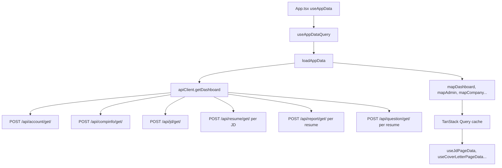
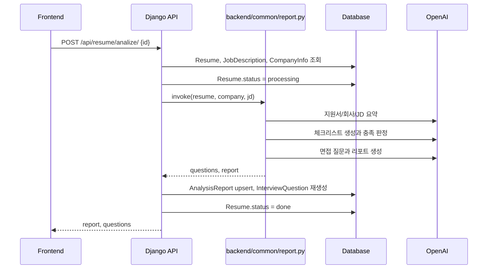
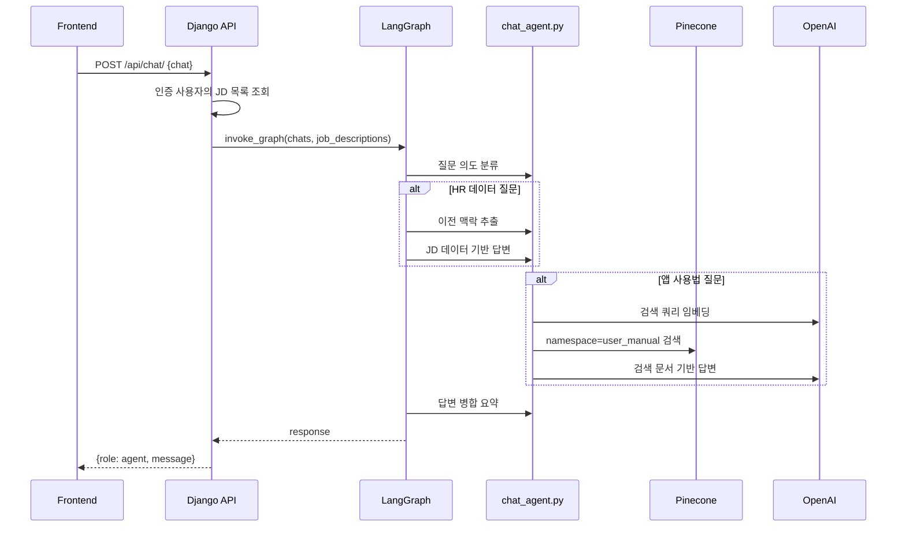

# 데이터 흐름

## 초기 화면 데이터 로딩

1. `frontend/src/main.tsx`가 `AppQueryProvider`와 `BrowserRouter`로 앱을 감쌉니다.
2. 인증 확인 후 `frontend/src/App.tsx`가 `useAppData()`를 호출합니다.
3. `useAppData()`는 `useAppDataQuery()`를 통해 `loadAppData()`를 실행합니다.
4. `frontend/src/api/appDataService.ts`는 `apiClient.getDashboard()`, `apiClient.getUserProfile()`, `apiClient.getAuthKeys()`를 병렬 호출합니다.
5. `frontend/src/api/adapters.ts`가 원천 데이터를 화면별 표시 모델로 변환합니다.
6. 각 페이지는 `useAppDataQuery()` 캐시에서 필요한 slice를 읽습니다. JD·지원서·리포트·채팅·관리자 화면은 `frontend/src/hooks/use*PageData.ts`가 담당합니다.

`getDashboard()`는 내부적으로 여러 Django API를 조합합니다. 근거: `frontend/src/api/backendClient.ts`의 `getDashboardData()`

## 페이지 데이터 slice

인증 후 `useAppDataQuery()`가 한 번 로드한 `AppData`를 여러 화면이 공유합니다. mutation 성공 시 `useInvalidateAppData()`가 캐시를 무효화해 최신 데이터를 다시 가져옵니다.

| 화면 | 데이터 훅 | mutation 훅 |
| --- | --- | --- |
| `/jd` | `useJdPageData` | `useJdMutations` |
| `/cover-letter` | `useCoverLetterPageData` | `useResumeMutations` |
| `/analysis-report` | `useAnalysisReportPageData` | — |
| `/chat`, FAB | `useChatPageData` + `useDocumentChatState` | `runApiAction` via chat send |
| `/admin` | `useAdminPageData` | `useAdminMutations` |

근거: `frontend/src/hooks/`, `frontend/scripts/verify-state-management-refactor.mjs`

## API 호출 흐름

1. Vite dev server가 `/api` 요청을 `http://127.0.0.1:8000`으로 프록시합니다. 근거: `frontend/vite.config.ts`
2. `apiClient`는 Axios 인스턴스로 `/api/.../`에 POST합니다. `withCredentials: true`로 세션 쿠키를 전달합니다.
3. POST 요청은 CSRF 쿠키가 없으면 `/api/csrf/`를 먼저 호출합니다.
4. `VITE_API_KEY`가 있으면 `X-API-Key` 헤더를 추가합니다.
5. Django는 `backend/api/urls.py`에 등록된 view로 요청을 보냅니다.
6. view는 `backend/api/models.py` 모델을 조회/수정하고 `to_dict()` 결과를 JSON으로 반환합니다.

## 지원서 분석 흐름

근거: `backend/api/views.py`, `backend/common/report.py`

## 채팅 흐름

근거: `backend/api/views.py`, `backend/common/chat_graph.py`, `backend/common/chat_agent.py`

## 공유 리포트 흐름

1. `/shared?resumeId=...` 접근 시 `SharedReportPage`가 API 키와 resume id 입력 폼을 표시합니다.
2. `apiClient.getSharedResumeBundle(resumeId, apiKey)`가 `X-API-Key`로 resume/report/question/JD를 조회합니다.
3. 공유 화면 채팅은 report/JD/question 요약을 대화 문맥에 포함해 `sendChatMessage()`를 호출합니다.

근거: `frontend/src/pages/SharedReportPage.tsx`, `frontend/src/api/backendClient.ts`

## 관련 문서

- [지원서 분석](../08-features/resume-analysis.md)
- [문서 검색 채팅](../08-features/document-chat.md)
- [프론트엔드 API 연동 README](../../frontend/README.md)
