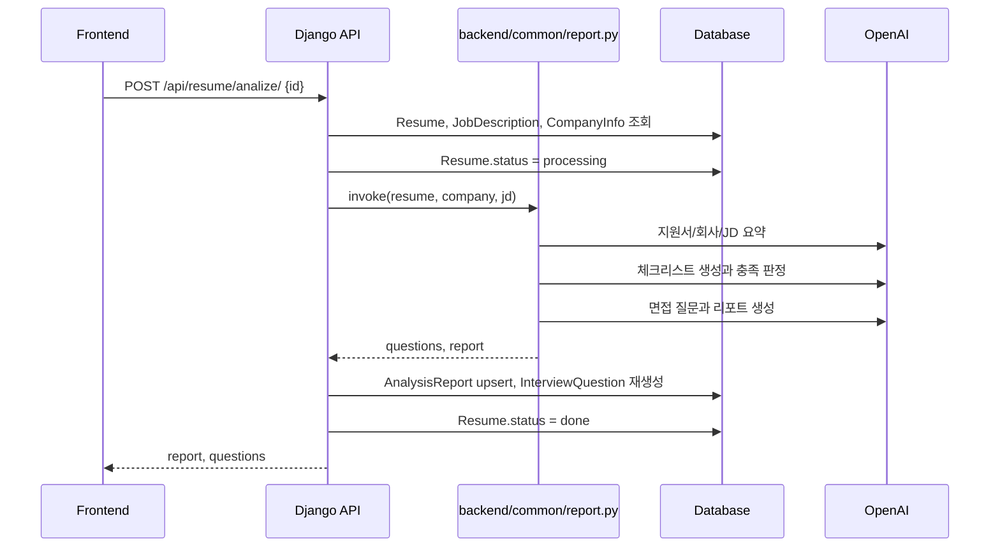
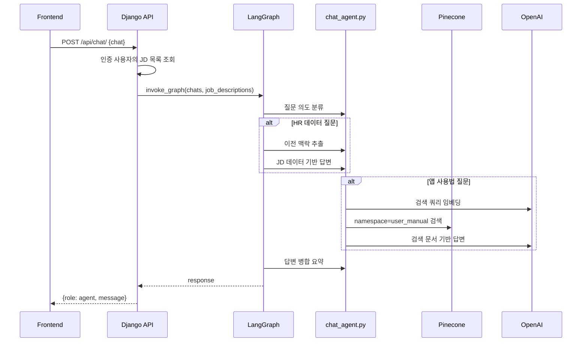

# 데이터 흐름

## 초기 화면 데이터 로딩

1. `frontend/src/main.tsx`가 `AppQueryProvider`와 `BrowserRouter`로 앱을 감쌉니다.
2. `frontend/src/App.tsx`가 `useMockAppData()`를 호출합니다.
3. `useMockAppData()`는 `useAppDataQuery()`를 통해 `loadAppData()`를 실행합니다.
4. `frontend/src/api/appDataService.ts`는 `apiClient.getDashboard()`와 `apiClient.getAuthDefaults()`를 가져옵니다.
5. `frontend/src/api/adapters.ts`가 원천 데이터를 화면별 표시 모델로 변환합니다.

기본 모드에서는 `frontend/src/api/backendClient.ts`의 `USE_MOCK_API`가 true라서 `frontend/src/data/apiMockData.ts`를 원천으로 사용합니다.

## 실제 API 호출 흐름

1. `VITE_USE_MOCK_API=false`인 경우 `apiClient`가 Axios 인스턴스로 `/api/.../`에 POST합니다.
2. POST 요청은 CSRF 쿠키가 없으면 `/api/csrf/`를 먼저 호출합니다.
3. `VITE_API_KEY`가 있으면 `X-API-Key` 헤더를 추가합니다.
4. Django는 `backend/api/urls.py`에 등록된 view로 요청을 보냅니다.
5. view는 `backend/api/models.py` 모델을 조회/수정하고 `to_dict()` 결과를 JSON으로 반환합니다.

## 지원서 분석 흐름

근거: `backend/api/views.py`, `backend/common/report.py`

## 채팅 흐름

근거: `backend/api/views.py`, `backend/common/chat_graph.py`, `backend/common/chat_agent.py`

## 관련 문서

- [지원서 분석](../08-features/resume-analysis.md)
- [문서 검색 채팅](../08-features/document-chat.md)
