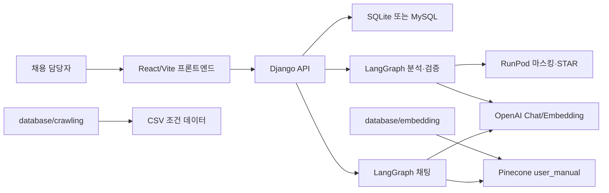

# 시스템 아키텍처

## 전체 구조

## 프론트엔드 계층

- `frontend/src/main.tsx`: React 앱 마운트, Router, Query Provider 연결
- `frontend/src/App.tsx`: 라우트 분기, 테마, 전역 알림·로딩, 인증 가드, `DocumentChatProvider`
- `frontend/src/hooks/`: TanStack Query 기반 페이지 데이터·mutation·채팅 컨텍스트
- `frontend/src/api/backendClient.ts`: Django API 호출(CSRF, credentials, `X-API-Key`)
- `frontend/src/api/appDataService.ts`: 대시보드 원천 데이터를 각 화면용 모델로 조립
- `frontend/src/api/adapters.ts`: 백엔드 응답 스키마를 화면 표시 모델로 변환
- `frontend/src/pages/`: 화면 단위 구성
- `frontend/src/components/`: 레이아웃, 차트, 채팅, 도메인 패널

## 백엔드 계층

- `backend/config/settings.py`: Django 설정, DB 선택, CORS/CSRF, 커스텀 유저 모델
- `backend/config/urls.py`: `/admin/`, `/api/` 루트 연결
- `backend/api/models.py`: 도메인 모델과 `to_dict()` 직렬화
- `backend/api/views/`: 도메인별 POST 기반 API 핸들러 (`account_endpoints.py`, `resume_endpoints.py` 등)
- `backend/common/analysis_graph.py`: 마스킹, STAR 구조화, 적합도 판정, 질문·리포트 생성과 품질 검증을 연결하는 운영 그래프
- `backend/common/analysis_agent.py`: 구조화 출력 기반 적합도·면접 질문·리포트 생성
- `backend/common/feedback_graph.py`: 생성 결과를 최대 3회 평가·보정
- `backend/common/masking.py`, `star_analysis.py`: OpenAI/RunPod 실행 경로 선택
- `backend/common/jd_chat_graph.py`: 회사/JD 누락 필드를 대화로 수집하고 저장
- `backend/api/tasks.py`: Celery 작업과 동기 fallback으로 분석 리포트 저장
- `backend/common/chat_graph.py`: 채팅 그래프 오케스트레이션
- `backend/common/chat_agent.py`: LLM agent, Pinecone 검색, 프롬프트

## 데이터 작업 계층

- `database/crawling/*_scraper.py`: 채용 사이트별 공고 조건 수집 후 공통 CSV 출력
- `database/embedding/chunk_embedding.ipynb`: 문서 청크화와 OpenAI 임베딩 생성
- `database/embedding/pinecone_uploader.ipynb`: 임베딩 BLOB를 Pinecone 벡터로 업로드

## 배포 계층

- `.github/workflows/deploy.yml`: `dev` 브랜치 push 또는 수동 실행 시 프론트/백엔드 배포
- `.deploy/frontend.conf`: 프론트 EC2의 nginx 정적 파일 라우팅
- `.deploy/backend.conf`: 백엔드 EC2의 nginx reverse proxy
- `.deploy/gunicorn.service`: Django WSGI를 `127.0.0.1:8000`에서 실행하는 systemd unit
- `.deploy/celery.service`: Valkey/Redis broker를 사용하는 Celery worker systemd unit

## 관련 문서

- [데이터 흐름](data-flow.md)
- [배포와 인프라](../09-deployment/deployment.md)
