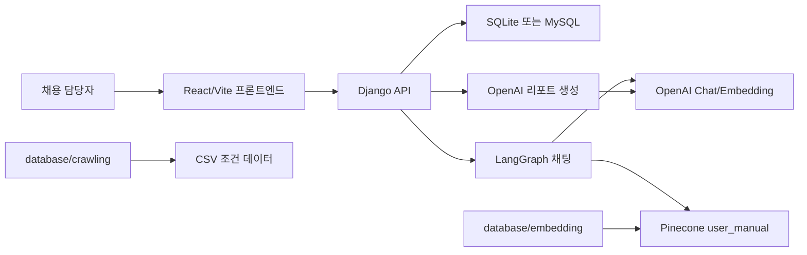

# 시스템 아키텍처

## 전체 구조

## 프론트엔드 계층

- `frontend/src/main.tsx`: React 앱 마운트, Router, Query Provider 연결
- `frontend/src/App.tsx`: 라우트 분기, 테마, 알림, 로딩 키, 선택 JD, 채팅 상태 관리
- `frontend/src/api/backendClient.ts`: Django API 호출(CSRF, credentials, `X-API-Key`)
- `frontend/src/api/appDataService.ts`: 대시보드 원천 데이터를 각 화면용 모델로 조립
- `frontend/src/api/adapters.ts`: 백엔드 응답 스키마를 화면 표시 모델로 변환
- `frontend/src/pages/`: 화면 단위 구성
- `frontend/src/components/`: 레이아웃, 차트, 채팅, 도메인 패널

## 백엔드 계층

- `backend/config/settings.py`: Django 설정, DB 선택, CORS/CSRF, 커스텀 유저 모델
- `backend/config/urls.py`: `/admin/`, `/api/` 루트 연결
- `backend/api/models.py`: 도메인 모델과 `to_dict()` 직렬화
- `backend/api/views.py`: POST 기반 API 핸들러
- `backend/common/report.py`: 지원서 분석 리포트/질문 생성
- `backend/common/chat_graph.py`: 채팅 그래프 오케스트레이션
- `backend/common/chat_agent.py`: LLM agent, Pinecone 검색, 프롬프트

## 데이터 작업 계층

- `database/crawling/*_scraper.py`: 채용 사이트별 공고 조건 수집 후 공통 CSV 출력
- `database/embedding/chunk_embedding.ipynb`: 문서 청크화와 OpenAI 임베딩 생성
- `database/embedding/pinecone_uploader.ipynb`: 임베딩 BLOB를 Pinecone 벡터로 업로드

## 배포 계층

- `Procfile`: `backend`에서 gunicorn 실행
- `.platform/nginx/conf.d/elasticbeanstalk/00_application.conf`: `/api/`, `/admin/`, `/static/`, SPA 정적 파일 라우팅
- `.platform/hooks/prebuild/01_mysqlclient_deps.sh`: Amazon Linux에서 `mysqlclient` 빌드 의존성 설치
- `.platform/hooks/predeploy/01_collectstatic.sh`, `.platform/hooks/predeploy/02_migrate.sh`: 정적 파일 수집과 마이그레이션
- `.github/workflows/deploy-eb.yml`: dev 브랜치 push 또는 수동 실행 시 빌드/검사/배포

## 관련 문서

- [데이터 흐름](data-flow.md)
- [배포와 인프라](../09-deployment/deployment.md)
