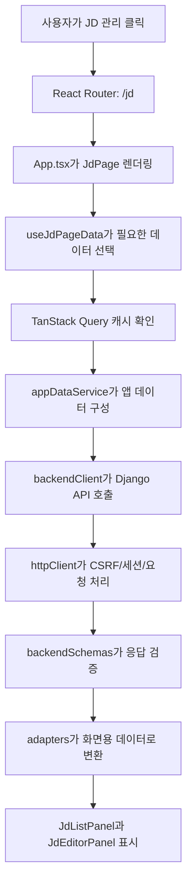

# HumouR 프론트엔드 쉽게 이해하기

이 문서는 비전공자도 HumouR 프론트엔드가 어떤 역할을 하고, 어떤 구조로 만들어졌는지 설명할 수 있도록 쓴 안내서입니다. 발표, 면접, 팀원 온보딩 때 그대로 읽어도 흐름이 잡히도록 기술 용어는 가능한 한 쉽게 풀어썼습니다.

근거가 되는 실제 코드 위치는 `frontend/` 폴더이며, 주요 파일은 `frontend/src/main.tsx`, `frontend/src/App.tsx`, `frontend/src/api/`, `frontend/src/hooks/`, `frontend/src/pages/`, `frontend/src/components/`, `frontend/src/styles.css`입니다.

## 1. 프론트엔드가 하는 일

프론트엔드는 사용자가 실제로 보는 화면을 담당합니다. 쉽게 말하면 다음을 만드는 부분입니다.

- 화면에 보이는 메뉴, 버튼, 입력창, 카드, 표
- 로그인 후 페이지 이동
- 사용자가 입력한 값을 backend로 보내는 일
- backend에서 받은 데이터를 보기 좋게 정리해 보여주는 일
- 저장 중, 로딩 중, 오류, 빈 상태 같은 사용자 경험 처리

HumouR 프로젝트에서 프론트엔드는 다음 기능을 담당합니다.

| 기능 | 프론트엔드에서 하는 일 |
|---|---|
| 로그인 / 회원가입 / 비밀번호 찾기 | 아이디, 비밀번호, 본인확인 질문을 입력받고 Django API와 연결합니다. |
| 대시보드 | JD, 지원자, 분석 결과, 포인트 상태를 한눈에 볼 수 있게 요약합니다. |
| 회사 정보 | 회사명, 인원수, 팀 구성, 회사 소개, 채용 성향을 입력하고 저장합니다. |
| JD 관리 | 채용 JD를 만들고, 수정하고, 삭제하고, 연결된 자소서가 있을 때 분석을 요청합니다. |
| 자기소개서 관리 | JD에 연결된 지원자 정보와 자기소개서 문항/답변을 저장하고 분석 요청을 합니다. |
| 분석 리포트 / 질문 추천 | AI 분석 결과와 추천 면접 질문을 분리된 탭으로 보여줍니다. |
| AI 채팅 | JD와 사용 가이드를 중심으로 채용 관련 질문을 할 수 있는 채팅 UI를 제공합니다. |
| 관리자 API key 관리 | 공유용 API key를 만들고, 특정 자소서에 접근 권한을 부여합니다. |
| 공유 리포트 | 로그인하지 않은 사람이 API key와 resume id로 리포트와 질문을 볼 수 있게 합니다. |

## 2. 전체 폴더 구조

`frontend/` 아래에서 중요한 폴더와 파일은 다음과 같습니다.

| 경로 | 역할 | 쉽게 말하면 |
|---|---|---|
| `frontend/package.json` | 사용 기술과 실행 명령 정의 | 이 프론트 앱의 준비물 목록과 실행 버튼 모음 |
| `frontend/vite.config.ts` | Vite 개발 서버, 테스트, 프록시 설정 | 개발 서버를 어떻게 켜고 backend로 어떻게 연결할지 정하는 파일 |
| `frontend/playwright.config.ts` | E2E 테스트 설정 | 실제 브라우저 테스트 환경 설정 |
| `frontend/eslint.config.js` | 코드 품질 검사 설정 | 실수나 위험한 코드 습관을 잡는 규칙 |
| `frontend/src/main.tsx` | 앱 시작점 | React 앱을 HTML에 꽂아 넣는 첫 파일 |
| `frontend/src/App.tsx` | 전체 앱 조립 | 로그인 상태, 라우팅, 테마, 공통 레이아웃을 연결하는 중심 |
| `frontend/src/api/` | backend 통신 계층 | Django API와 대화하는 창구 |
| `frontend/src/hooks/` | 반복 로직 모음 | 여러 화면에서 같이 쓰는 데이터/상태 처리법 |
| `frontend/src/pages/` | 페이지 화면 | `/jd`, `/admin`처럼 주소별로 보이는 큰 화면 |
| `frontend/src/components/` | 재사용 UI 조각 | 여러 페이지에서 쓰는 카드, 폼, 표, 패널 부품 |
| `frontend/src/data/` | 공통 데이터 설정과 타입 | 메뉴, 색상, backend 데이터 모양 설명 |
| `frontend/src/types/` | 앱에서 공유하는 타입 | 함수 모양, 테마 모드 같은 공통 약속 |
| `frontend/src/utils/` | 작은 도우미 함수 | 경로, 레이아웃 간격, 상태 태그 처리 |
| `frontend/src/styles.css` | 디자인 시스템 구현 | 색상, 카드, 간격, 반응형, dark mode 스타일 |
| `frontend/src/test/` | 단위 테스트 준비 | Vitest와 MSW 테스트 공통 설정 |
| `frontend/tests/e2e/` | 브라우저 테스트 | Playwright로 실제 화면 접근성 등을 확인 |
| `frontend/scripts/verify-*.mjs` | 시나리오 검증 스크립트 | 실제 화면 흐름을 자동으로 눌러보는 검사 도구 |
| `frontend/public/assets/` | 로고와 이미지 | 앱에서 쓰는 HumouR 로고 파일 |

## 3. 주요 파일별 역할

### `src/main.tsx`

React 앱이 시작되는 파일입니다.

이 파일은 다음 일을 합니다.

1. `index.html` 안의 `root` 영역을 찾습니다.
2. React 앱을 그 영역에 렌더링합니다.
3. `BrowserRouter`로 페이지 이동 기능을 켭니다.
4. `AppQueryProvider`로 TanStack Query 데이터 관리 환경을 제공합니다.
5. Ant Design 기본 reset CSS와 프로젝트 전체 CSS를 불러옵니다.

쉽게 말하면 “앱의 전원 버튼”입니다.

### `src/App.tsx`

앱 전체를 조립하는 중심 파일입니다.

주요 역할은 다음과 같습니다.

- 현재 주소가 `/login`인지, `/dashboard`인지, `/shared`인지 판단
- 로그인 여부 확인
- 로그인 화면, 공유 화면, 보호된 업무 화면을 나누어 렌더링
- light/dark mode 전환
- Ant Design 테마 설정
- 전체 shell 레이아웃 연결
- 전역 알림 연결
- 플로팅 AI 채팅 위젯 연결

최근 구조는 `App.tsx`가 모든 데이터를 직접 소유하기보다, 페이지별 hook이 필요한 데이터를 가져가는 방향입니다. 그래서 `App.tsx`는 “모든 일을 하는 파일”이 아니라 “교통정리와 공통 껍데기를 담당하는 파일”에 가깝습니다.

### `src/api/httpClient.ts`

실제 HTTP 요청을 보내는 가장 낮은 단계의 통신 파일입니다.

담당하는 일은 다음과 같습니다.

- Axios 인스턴스 생성
- `/api/` prefix 기준으로 Django API 호출
- 세션 로그인을 위해 `withCredentials: true` 유지
- POST 요청 전에 CSRF token 확인
- backend 응답의 `error: true`를 실제 오류로 처리
- 공유 페이지처럼 필요한 경우에만 `X-API-Key`를 명시적으로 붙임

중요한 보안 포인트가 있습니다.

브라우저 번들에 들어가는 `VITE_API_KEY` 같은 전역 key를 자동으로 모든 요청에 붙이지 않습니다. API key는 공유 페이지처럼 사용자가 입력한 값을 특정 요청에만 명시적으로 전달합니다.

### `src/api/backendClient.ts`

프론트에서 backend 기능을 부를 때 사용하는 대표 창구입니다.

예를 들면 다음 함수들이 있습니다.

- `login`
- `completeSignup`
- `checkSignupId`
- `saveCompanyProfile`
- `addJobDescription`
- `saveJobDescription`
- `addResume`
- `saveResume`
- `requestResumeAnalysis`
- `sendChatMessage`
- `addAuthKey`
- `getSharedResumeBundle`

쉽게 말해, 각 페이지가 직접 `/api/jd/add/` 같은 주소를 외우지 않도록 “backend 호출 메뉴판”을 만들어 둔 곳입니다.

### `src/api/appDataService.ts`

여러 backend 데이터를 프론트 화면용으로 묶는 곳입니다.

`loadAppData()`는 dashboard, auth key 등 앱에서 자주 쓰는 데이터를 가져온 뒤 다음 화면용 데이터로 정리합니다.

- 대시보드 데이터
- 관리자 데이터
- 회사 정보
- JD 목록
- 자소서 목록
- 분석 리포트
- 면접 질문
- 사용자 프로필

쉽게 말하면 “backend에서 온 재료를 화면이 바로 쓸 수 있는 도시락으로 포장하는 곳”입니다.

### `src/api/adapters.ts`

backend 응답을 화면에서 쓰기 좋은 이름과 구조로 바꾸는 곳입니다.

예를 들어 backend의 `job_name`, `required_skill`, `self_intoduction` 같은 필드는 화면에서 바로 쓰기에는 딱딱하거나 오탈자처럼 보일 수 있습니다. adapter는 이런 데이터를 `title`, `stack`, `coverRows`처럼 화면에 어울리는 구조로 바꿉니다.

backend 데이터를 그대로 화면에 쓰지 않는 이유는 다음과 같습니다.

- backend 필드명이 바뀌어도 화면 변경을 줄일 수 있음
- 화면에 필요한 계산값을 미리 만들 수 있음
- 빈 값, 점수, 상태 문구를 한곳에서 통일할 수 있음
- 같은 데이터를 여러 페이지에서 일관되게 보여줄 수 있음

### `src/api/backendSchemas.ts`

Zod를 사용해 backend 응답 모양을 검사하는 곳입니다.

쉽게 말하면 “택배 검수”입니다. backend에서 받은 데이터가 우리가 기대한 모양인지 확인합니다. 예를 들어 JD는 `id`, `job_name`, `career_level`, `status` 같은 값이 있어야 하고, resume은 `self_intoduction`이라는 현재 backend 계약 필드를 포함해야 합니다.

### `src/hooks/*`

여러 화면에서 반복되는 로직을 모아둔 곳입니다.

| hook | 역할 |
|---|---|
| `useAuthSession` | 현재 로그인되어 있는지 확인 |
| `useAppData` / `useAppDataQuery` | TanStack Query로 앱 데이터를 가져옴 |
| `useApiAction` | 저장/로그인 같은 액션의 로딩, 알림, 중복 실행 방지 처리 |
| `useJdPageData` | JD 페이지에 필요한 데이터만 골라 줌 |
| `useCoverLetterPageData` | 자소서 페이지에 필요한 JD·지원서 목록과 현재 선택 id를 골라 줌 |
| `useAnalysisReportPageData` | 리포트/질문 추천 페이지 데이터 선택 |
| `useChatPageData` | 채팅 추천 데이터 생성에 필요한 데이터 제공 |
| `useDocumentChatState` | 채팅 입력값, 메시지, 전송 실패 롤백 처리 |
| `hooks/mutations/*` | 저장, 삭제, 분석 요청 같은 서버 변경 작업 처리 |

### `src/components/common/PageTitle.tsx`와 `SectionCard.tsx`

HumouR 화면의 공통 골격입니다.

- `PageTitle`: 화면 맨 위 제목, 설명, 주요 버튼 영역
- `SectionCard`: 업무 단위를 담는 카드

예를 들어 `/jd` 화면은 위에 `PageTitle`이 있고, 아래에 `JD 목록` 카드와 `JD 작성/수정` 카드가 있습니다. 이 구조를 여러 페이지에서 반복하면 사용자가 페이지를 바꿔도 비슷한 리듬으로 사용할 수 있습니다.

### `src/styles.css`

전체 디자인 시스템을 실제로 구현한 파일입니다.

담당하는 내용은 다음과 같습니다.

- 색상 토큰: `--primary`, `--surface`, `--text`, `--border`
- 카드 반경과 그림자
- 페이지 간격
- light/dark mode
- 모바일 반응형
- 채팅 위젯, sidebar, auth 화면, shared 화면 스타일

## 4. 우리가 사용한 기술과 이유

| 기술 | 무엇인가요? | 왜 사용했나요? | 대안 | 왜 이 선택이 맞았나요? |
|---|---|---|---|---|
| React 19 | 화면을 컴포넌트 단위로 만드는 JavaScript 라이브러리 | 페이지와 버튼, 폼을 재사용 부품처럼 만들기 좋음 | Vue, Svelte, Angular | 팀과 생태계가 크고, Ant Design/TanStack Query와 잘 맞음 |
| TypeScript | JavaScript에 타입 검사를 더한 언어 | 데이터 모양 실수를 빨리 잡기 위해 | JavaScript | backend 응답 필드가 많아 타입 안정성이 중요함 |
| Vite | 빠른 개발 서버와 빌드 도구 | 개발 중 화면 반영이 빠르고 설정이 단순함 | Webpack, CRA | React 프로젝트를 빠르게 개발하기 좋음 |
| Ant Design | 기업용 UI 컴포넌트 라이브러리 | 폼, 버튼, 표, 카드, 모달을 빠르게 안정적으로 만들 수 있음 | MUI, Chakra UI, shadcn/ui | B2B 운영툴인 HumouR에는 완성도 높은 폼/테이블이 중요함 |
| Ant Design X | 채팅 UI와 AI형 인터페이스에 특화된 Ant Design 확장 | `Bubble`, `Sender`, `Prompts`, `Sources`로 채팅 화면을 빠르게 구현 | 직접 구현, Vercel AI SDK UI | 기존 Ant Design 디자인과 결이 맞음 |
| TanStack Query | 서버 데이터 가져오기/캐싱 도구 | JD, resume, report 같은 서버 데이터를 안정적으로 관리 | Redux, Zustand, SWR | 서버 데이터가 많기 때문에 전역 store보다 Query 캐시가 적합함 |
| Axios | HTTP 요청 라이브러리 | interceptor로 CSRF, API key, 오류 처리를 모으기 좋음 | fetch | 반복되는 요청 설정을 한곳에서 관리하기 쉬움 |
| React Router | 주소별 페이지 이동 도구 | `/jd`, `/admin`, `/shared` 같은 route를 관리 | Next.js router, TanStack Router | 현재 Vite SPA 구조에 자연스럽게 맞음 |
| ECharts | 차트 라이브러리 | 대시보드 donut chart 같은 시각화를 구현 | Recharts, Chart.js | SVG 렌더링과 커스터마이징이 유연함 |
| Zod | 데이터 검증 라이브러리 | backend 응답이 기대한 모양인지 확인 | Yup, 직접 검사 | TypeScript와 함께 쓰기 좋고 schema가 명확함 |
| Vitest | 단위 테스트 도구 | Vite와 잘 맞고 빠름 | Jest | 현재 Vite 기반 프로젝트라 설정이 자연스러움 |
| Testing Library | React 컴포넌트 테스트 도구 | 사용자가 보는 방식으로 테스트 작성 가능 | Enzyme | 실제 사용자 관점 테스트에 적합함 |
| MSW | API mock 도구 | 테스트에서 가짜 backend 응답을 안정적으로 제공 | 직접 mock, jest mock | 실제 HTTP 흐름과 비슷하게 테스트 가능 |
| Playwright | 브라우저 자동 테스트 도구 | 실제 Chrome/Edge에서 화면 접근성과 흐름 확인 | Cypress | 여러 브라우저/viewport 검증에 강함 |
| ESLint | 코드 품질 검사 도구 | 위험한 패턴, hook 규칙 위반, 스타일 문제를 잡음 | Biome, StandardJS | TypeScript/React/TanStack Query 규칙을 함께 적용 가능 |

## 5. 다른 기술도 있는데 왜 이걸 썼나요?

### React vs Vue/Svelte/Angular

네 기술 모두 좋은 선택입니다. HumouR는 기업용 화면, 폼, 표, 데이터 흐름이 많습니다. React는 관련 생태계가 매우 넓고 Ant Design, TanStack Query, Testing Library와 잘 맞습니다. 그래서 팀 프로젝트에서 자료를 찾고 유지보수하기 쉽다는 장점이 큽니다.

### Vite vs Webpack/CRA

Webpack은 강력하지만 설정이 무거울 수 있습니다. CRA는 예전에는 편했지만 현재는 Vite가 더 빠르고 단순한 선택입니다. HumouR는 빠르게 개발하고 자주 화면을 확인해야 하므로 Vite가 잘 맞습니다.

### Ant Design vs MUI/Chakra/shadcn/ui

MUI와 Chakra도 좋고, shadcn/ui는 디자인 커스터마이징 자유도가 큽니다. 다만 HumouR는 관리자 화면, 폼, 표, Select, Modal이 많은 B2B 운영툴입니다. Ant Design은 이런 부품이 이미 풍부해서 구현 속도와 안정성이 좋습니다.

디자인을 크게 바꾼다면 장기적으로 `Tailwind CSS + shadcn/ui`도 좋은 후보입니다. 하지만 지금 단계에서는 Ant Design을 유지하고 theme token과 CSS token을 잘 다듬는 쪽이 비용 대비 효과가 큽니다.

### TanStack Query vs Zustand/Redux/SWR

Zustand와 Redux는 앱 안의 전역 상태를 관리하기 좋습니다. 하지만 HumouR의 중요한 데이터는 대부분 서버에서 옵니다.

- JD 목록
- 자소서 목록
- 분석 리포트
- 면접 질문
- auth key 목록

이런 데이터는 “서버 데이터”라서 캐싱, 새로고침, 실패 처리, 재요청이 중요합니다. TanStack Query가 바로 이 문제를 잘 해결합니다. 그래서 현재 프로젝트는 Zustand/Redux를 추가하지 않고 TanStack Query 중심으로 정리했습니다.

### Axios vs fetch

`fetch`는 브라우저 기본 기능이라 가볍습니다. 하지만 HumouR는 모든 POST에 CSRF token이 필요하고, 일부 요청은 `X-API-Key`가 필요합니다. Axios interceptor를 쓰면 이런 공통 처리를 `httpClient.ts` 한곳에 모을 수 있습니다.

### Vitest vs Jest

Jest도 많이 쓰입니다. 하지만 Vite 프로젝트에서는 Vitest가 설정이 쉽고 속도가 빠릅니다. 현재 테스트도 Vitest 기반으로 구성되어 있습니다.

### Playwright vs Cypress

Cypress는 개발자가 직접 화면을 보며 테스트하기 좋습니다. Playwright는 Chrome, Edge 같은 실제 브라우저를 자동으로 띄워 다양한 환경을 확인하기 좋습니다. HumouR는 verify script와 함께 headless 브라우저 검증을 많이 하므로 Playwright가 잘 맞습니다.

## 6. 화면이 만들어지는 흐름: `/jd` 페이지 예시

사용자가 JD 관리 페이지에 들어가면 다음 일이 일어납니다.

1. 사용자가 메뉴에서 `JD 관리`를 누릅니다.
2. React Router가 주소를 `/jd`로 바꿉니다.
3. `App.tsx`가 현재 route가 `/jd`임을 확인하고 `JdPage`를 보여줍니다.
4. `useJdPageData`가 TanStack Query 캐시에서 JD와 resume 데이터를 가져옵니다.
5. 데이터가 없다면 `appDataService`가 `backendClient`를 통해 Django API에 요청합니다.
6. `backendClient`는 `httpClient`를 사용해 `/api/jd/get/`, `/api/resume/get/` 같은 API를 호출합니다.
7. `backendSchemas`가 응답 모양을 검사합니다.
8. `adapters`가 backend 데이터를 화면용 데이터로 바꿉니다.
9. `JdPage`가 `PageTitle`, `SectionCard`, `JdListPanel`, `JdEditorPanel`로 화면을 그립니다.
10. 사용자가 저장을 누르면 `useJdMutations`가 `jd/add` 또는 `jd/modify` API를 호출하고, 성공하면 Query 캐시를 다시 갱신합니다.

## 7. 서버와 프론트가 데이터를 주고받는 방식

HumouR frontend는 Django backend와 `/api/` 경로로 통신합니다.

### 세션 로그인

일반 사용자는 로그인하면 Django session을 사용합니다. 브라우저는 쿠키를 가지고 있고, frontend는 요청할 때 `withCredentials: true`를 유지합니다.

### CSRF

CSRF는 “내가 의도하지 않은 요청을 다른 사이트가 대신 보내는 공격”을 막기 위한 보호 장치입니다. Django는 POST 요청에 CSRF token을 요구합니다.

`httpClient.ts`는 POST 요청 전에 `/api/csrf/`로 token을 확보하고, `X-CSRFToken` 헤더에 넣습니다.

### API key

공유 리포트처럼 로그인 없이 접근해야 하는 기능은 API key를 씁니다.

현재 구조에서는 API key를 전역 환경변수로 자동 주입하지 않습니다. 사용자가 공유 페이지에서 입력한 key만 해당 요청에 명시적으로 넣습니다.

### 데이터 처리 계층

| 계층 | 파일 | 쉽게 말하면 |
|---|---|---|
| HTTP 기본 처리 | `src/api/httpClient.ts` | 요청 보내기, CSRF, API key, 오류 처리 |
| API 기능 함수 | `src/api/backendClient.ts` | 로그인, JD 저장, 분석 요청 같은 backend 메뉴 |
| 응답 검증 | `src/api/backendSchemas.ts` | backend 응답 모양 검사 |
| 화면용 변환 | `src/api/adapters.ts` | 화면에 맞는 이름과 구조로 바꾸기 |
| 앱 데이터 묶음 | `src/api/appDataService.ts` | 여러 데이터를 한 번에 화면용으로 구성 |

backend 데이터를 그대로 화면에 쓰지 않고 schema와 adapter를 거치는 이유는 “backend 계약”과 “화면 표현”을 분리하기 위해서입니다. 이렇게 하면 backend 필드명이 다소 어색하거나, 화면에서 필요한 계산값이 있어도 한곳에서 정리할 수 있습니다.

## 8. 상태관리 설명

상태는 크게 두 종류입니다.

### 서버 데이터

서버에서 온 데이터입니다.

- JD 목록
- 회사 정보
- 자소서 목록
- 분석 리포트
- 면접 질문
- API key 목록
- 사용자 프로필

이 데이터는 TanStack Query가 관리합니다. 서버 데이터는 다시 불러오기, 캐싱, 실패 처리, 저장 후 갱신이 중요하기 때문입니다.

### 화면 임시 상태

화면 안에서만 잠깐 쓰는 데이터입니다.

- 현재 선택된 JD
- 모달이 열렸는지 여부
- 입력창에 아직 저장하지 않은 글
- 채팅 입력값
- 새 API key를 방금 발급받았을 때만 보여주는 원문 key

이런 데이터는 각 페이지나 hook의 `useState`로 관리합니다.

즉, 서버 데이터는 TanStack Query, 화면 안 임시 상태는 React state로 나눠 관리합니다. 그래서 Redux나 Zustand 같은 별도 전역 store 없이도 구조를 유지할 수 있습니다.

## 9. 디자인 시스템 설명

HumouR는 채용 담당자가 반복해서 쓰는 B2B 운영툴입니다. 그래서 화려한 랜딩 페이지보다 정보를 빠르게 보고, 입력하고, 비교하는 화면이 중요합니다.

디자인 시스템의 핵심은 다음입니다.

| 요소 | 설명 |
|---|---|
| `PageTitle` | 페이지 제목, 설명, 주요 버튼을 같은 위치에 배치 |
| `SectionCard` | 업무 단위를 카드로 나눔 |
| CSS token | `--primary`, `--surface`, `--text`, `--border`, `--layout-gap` 같은 공통 값 |
| light/dark mode | 같은 컴포넌트가 밝은 모드와 어두운 모드에서 모두 보이게 함 |
| 카드 간격 | `--layout-gap` 기준으로 페이지 간격을 통일 |
| 버튼 스타일 | primary는 주요 실행, default는 보조 실행, danger는 삭제/위험 작업 |

페이지마다 같은 카드 구조를 쓰는 이유는 사용자가 매번 새 화면을 배울 필요가 없게 하기 위해서입니다.

예를 들어 JD 관리와 자기소개서 관리는 둘 다 다음 구조를 가집니다.

- 왼쪽: 목록
- 오른쪽: 작성/수정 폼
- 위쪽: 저장, 분석 요청 같은 주요 액션

이 구조가 반복되면 사용자는 새 기능을 봐도 “아, 왼쪽에서 고르고 오른쪽에서 수정하는구나”라고 바로 이해할 수 있습니다.

## 10. 테스트와 품질 관리

현재 frontend에는 여러 종류의 검증이 있습니다.

| 명령 / 도구 | 역할 | 쉽게 말하면 |
|---|---|---|
| `npm run lint` | ESLint 검사 | 코드 문법과 위험한 습관 검사 |
| `npx tsc --noEmit` | TypeScript 타입 검사 | 조립 전에 부품 모양이 맞는지 검사 |
| `npm run test` | Vitest 단위 테스트 | 작은 기능들이 의도대로 동작하는지 검사 |
| `npm run build` | production build | 실제 배포용으로 조립되는지 검사 |
| `npm run test:e2e` | Playwright E2E 테스트 | 실제 브라우저에서 화면을 열어보는 검사 |
| `scripts/verify-*.mjs` | 시나리오 검증 | 로그인, JD 생성, 자소서 저장, 채팅 등 흐름 자동 확인 |
| MSW | API mock | 테스트 중 가짜 backend 응답 제공 |
| Testing Library | 컴포넌트 테스트 | 사용자가 보는 방식으로 버튼/입력창 검사 |

쉽게 비유하면 다음과 같습니다.

- `lint`: 맞춤법 검사
- `TypeScript`: 부품 규격 검사
- `unit test`: 작은 부품 작동 검사
- `build`: 전체 조립 검사
- `Playwright/verify script`: 사람이 클릭하는 것처럼 실제 사용 흐름 검사

현재 주요 verify script 예시는 다음과 같습니다.

- `verify-backend-contract.mjs`: frontend가 실제 backend API 계약을 따르는지 검사
- `verify-auth-flow.mjs`: 로그인/회원가입/비밀번호 찾기 흐름 검사
- `verify-jd-create-flow.mjs`: JD 생성 흐름 검사
- `verify-cover-letter-save-flow.mjs`: 자소서 저장/분석 흐름 검사
- `verify-analysis-report-page.mjs`: 분석 리포트/질문 추천 페이지 검사
- `verify-chat-context-real-data.mjs`: 채팅 추천 데이터가 실제 데이터 기반인지 검사
- `verify-document-chat-widget.mjs`: 플로팅 AI 채팅 위젯 검사
- `verify-shared-route.mjs`: 공유 리포트 페이지 검사
- `verify-qa-stability-fixes.mjs`: 보안/중복 실행/UX 안정성 회귀 검사

## 11. 앞으로 개선하면 좋은 점

현재 구조는 MVP 기능을 실제 Django API와 연결하는 데 초점이 맞춰져 있습니다. 다음 단계에서는 아래 개선을 고려할 수 있습니다.

| 개선점 | 기대 효과 |
|---|---|
| backend aggregate API 추가 | 초기 화면 로딩이 빨라짐. 현재는 JD별 resume, resume별 report/question을 여러 번 요청하는 N+1 구조가 남아 있음 |
| route code splitting | 첫 JavaScript 번들 크기를 줄여 첫 로딩 속도 개선 |
| verify script를 CI에 연결 | 배포 전 자동으로 로그인, JD, 자소서, 채팅 흐름 검사 가능 |
| shared/chat E2E 확대 | API key 공유, 비로그인 조회, 채팅 실패 상황을 더 촘촘히 검증 |
| CSS 파일 분리 | `styles.css`가 커졌기 때문에 도메인별 스타일 관리가 쉬워짐 |
| 디자인 전환 실험 | Ant Design 유지가 현실적이지만, 장기적으로 `Tailwind CSS + shadcn/ui` 실험 가능 |

## 12. 한 문장으로 정리

HumouR 프론트엔드는 React와 TypeScript로 만든 채용 운영 화면이며, Ant Design으로 빠르고 일관된 UI를 만들고, TanStack Query와 API adapter 계층으로 Django backend 데이터를 안정적으로 가져와 JD 관리, 자소서 저장, AI 분석 리포트, 질문 추천, 공유 리포트, AI 채팅을 사용자가 이해하기 쉬운 화면으로 보여주는 역할을 합니다.
