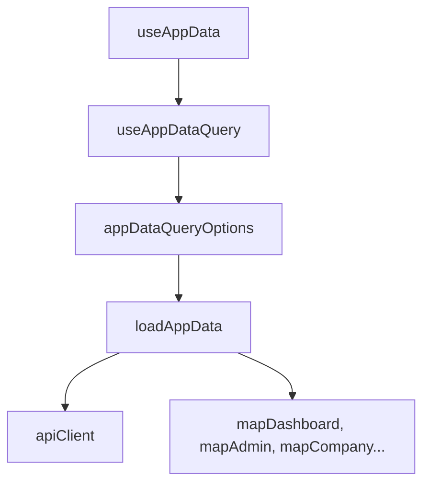

# 상태와 API 어댑터

## 전역 화면 상태

`frontend/src/App.tsx`가 다음 상태를 직접 관리합니다.

- `mode`: light/dark 테마
- `alert`: 전역 알림
- `loadingKey`: 중복 액션 방지와 버튼 로딩 표시
- `chatMessages`, `chatInput`: 전체 화면 채팅과 FAB 채팅이 공유
- `selectedJdIdOverride`, `selectedRowKeys`: JD 선택/공고 선택
- `coverUploaded`, `analysisDone`: 지원서 업로드/분석 완료 표시
- `resetStep`: 비밀번호 재설정 단계
- `authChecked`, `isAuthenticated`: 세션 인증 확인

후순위 MVP 화면의 `postGenerated`, `templateGenerated`는 현재 `false` 상수로 고정되어 있습니다. 근거: `frontend/src/App.tsx`

## 데이터 로딩

근거:

- `frontend/src/hooks/useAppData.ts`
- `frontend/src/hooks/useAppDataQuery.ts`
- `frontend/src/api/queryOptions.ts`
- `frontend/src/api/appDataService.ts`
- `frontend/src/api/adapters.ts`

인증 라우트(`/login`, `/signup`, `/password-reset`)와 공유 화면(`/shared`)에서는 `useAppData(false)`로 대시보드 로딩을 건너뜁니다.

## API 클라이언트

`frontend/src/api/backendClient.ts`는 Django API만 호출합니다.

중요 구현:

- Axios `baseURL: '/api'`, `withCredentials: true`
- POST 전에 CSRF 쿠키가 없으면 `/api/csrf/`를 호출합니다.
- `VITE_API_KEY`가 있으면 `X-API-Key` 헤더를 붙입니다.
- Django 응답이 `{ error, data, message }` 형태가 아니어도 `normalizePayload()`로 감쌉니다.
- `getDashboard()`는 account/company/JD/resume/report/question API를 조합합니다.
- backend API가 없는 후순위 기능은 `unsupportedBackendFeature()`로 명시적 오류를 던집니다.

## 어댑터 역할

`frontend/src/api/adapters.ts`는 API 스키마를 화면별 모델로 바꿉니다.

- `mapDashboard`: metrics, applicants, insightCards, tasks, creditPercent 생성
- `mapAdmin`: 관리자 요약, 멤버, 권한, 운영 상태 생성
- `mapCompany`: 회사 정보 완성도 계산
- `mapJdList`: JD 목록 표시 모델과 평균 적합도 생성
- `mapCoverLetterRows`: 지원서 테이블 행 생성
- `mapAnalysisReport`: 리포트 탭, 예시 질문, 초기 채팅 메시지 생성
- `mapTemplateQuestions`: 면접 질문을 자기소개서 문항 가이드로 변환
- `mapUserProfile`: 계정 정보를 마이페이지 표시 모델로 변환

## 실제 API 연동 시 주의점

- `apiClient.requestJobAnalysis()`와 `requestCoverLetterAnalysis()`는 선택 JD의 첫 번째 이력서를 분석 대상으로 삼습니다.
- 프론트 `assistant` role은 `/api/chat/` 요청 전 `agent`로 변환합니다.
- `account/modify` payload에서 `id`, `username`, `account_hash`는 제거합니다.

## 관련 문서

- [API 레퍼런스](../06-api/api-reference.md)
- [데이터 흐름](../02-architecture/data-flow.md)
- [프론트엔드 API 연동 README](../../frontend/README.md)
