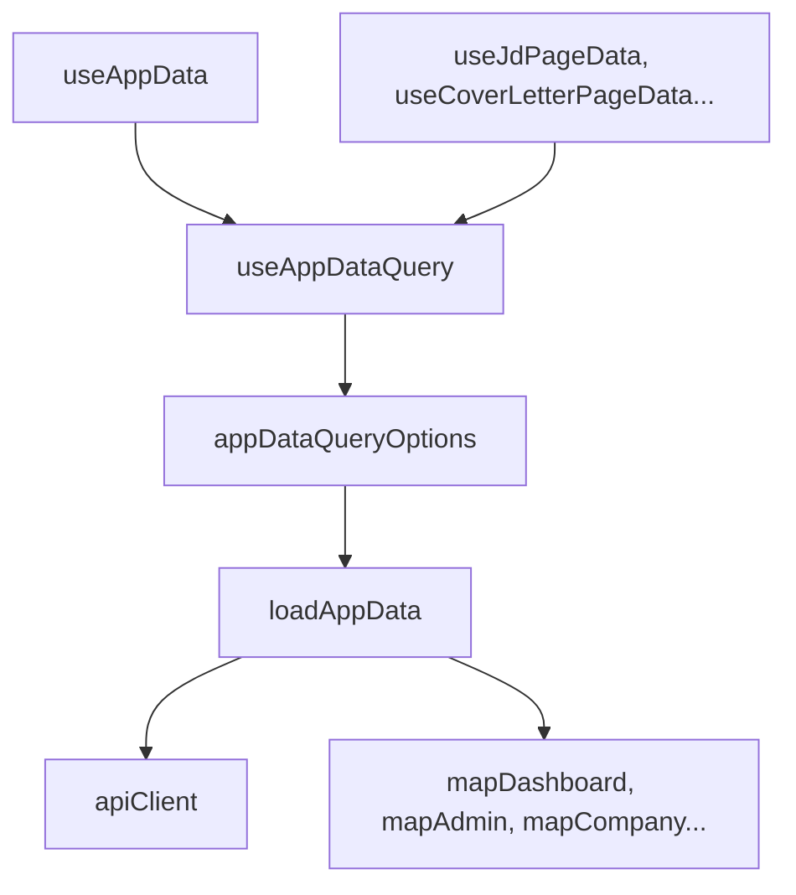

# 상태와 API 어댑터

## 전역 화면 상태 (`App.tsx`)

`frontend/src/App.tsx`는 라우팅, 인증 가드, 테마, 전역 알림·로딩만 담당합니다.

- `mode`: light/dark 테마
- `alert`, `loadingKey`: `useApiAction()` — 전역 토스트와 중복 액션 방지
- `resetStep`: 비밀번호 재설정 단계
- `authChecked`, `isAuthenticated`, `authMode`, `apiKey`: `useAuthSession()` — 세션 또는 API Key 접근 확인

도메인별 선택 상태, 채팅 입력, mutation 호출은 `App.tsx`에 두지 않습니다. `frontend/scripts/verify-state-management-refactor.mjs`가 이 분리를 정적으로 검증합니다.

## 페이지·도메인 훅

각 화면은 `useAppDataQuery()` 캐시에서 필요한 slice를 고르고, 로컬 UI 상태는 전용 훅이 관리합니다.

| 훅 | 파일 | 역할 |
| --- | --- | --- |
| `useAppData` | `frontend/src/hooks/useAppData.ts` | 인증 후 초기 `AppData` 로딩 (`loading`, `error`, `reload`) |
| `useAppDataQuery` | `frontend/src/hooks/useAppDataQuery.ts` | TanStack Query 래퍼, `appDataQueryOptions` 연결 |
| `useJdPageData` | `frontend/src/hooks/useJdPageData.ts` | JD 목록·선택 JD (`selectedJdIdOverride`) |
| `useCoverLetterPageData` | `frontend/src/hooks/useCoverLetterPageData.ts` | 지원서 행, JD·지원서 선택 (`selectedJdId`, `selectedResumeId`) |
| `useAnalysisReportPageData` | `frontend/src/hooks/useAnalysisReportPageData.ts` | 리포트 목록, `?reportId=` URL 선택과 `?resumeId=` 레거시 선택 |
| `useChatPageData` | `frontend/src/hooks/useChatPageData.ts` | 채팅 컨텍스트용 리포트·JD·질문 slice |
| `useAdminPageData` | `frontend/src/hooks/useAdminPageData.ts` | 관리자 요약, AuthKey 목록 |
| `DocumentChatProvider` / `useDocumentChatState` | `frontend/src/hooks/useDocumentChatState.ts` | FAB·`/chat` 공유 채팅 메시지·입력·전송 |

mutation 훅 (`frontend/src/hooks/mutations/`):

- `useJdMutations` — JD 추가·수정·삭제·분석 요청
- `useResumeMutations` — 지원서 CRUD·분석 요청
- `useAdminMutations` — AuthKey CRUD
- `useMutationHelpers` — `useInvalidateAppData()`로 mutation 후 캐시 무효화

`AdminPage`의 `createdAuthKey`처럼 화면 전용 일시 상태는 해당 페이지 `useState`로 유지합니다. 근거: `frontend/src/pages/AdminPage.tsx`

## 데이터 로딩

근거:

- `frontend/src/hooks/useAppData.ts`
- `frontend/src/hooks/useAppDataQuery.ts`
- `frontend/src/api/queryOptions.ts`
- `frontend/src/api/appDataService.ts`
- `frontend/src/api/adapters.ts`

인증 라우트(`/login`, `/signup`, `/password-reset`)와 공유 화면(`/shared`)에서는 `useAppData(false)`로 대시보드 로딩을 건너뜁니다.

API Key 모드에서는 `appDataQueryOptions()`가 query key에 `authMode`와 API key fingerprint를 포함하고 `loadApiKeyAppData(apiKey)`를 호출합니다. 일반 세션 모드는 `loadAppData()`를 사용합니다.

`queryOptions.ts`는 `AnalysisReport.status`가 `onqueue` 또는 `processing`인 항목이 있으면 3초 간격(`ACTIVE_ANALYSIS_REFETCH_INTERVAL_MS = 3000`)으로 `appData`를 재조회합니다.

## API 클라이언트

`frontend/src/api/backendClient.ts`는 Django API만 호출합니다. Axios 인스턴스와 CSRF 쿠키 처리는 `frontend/src/api/httpClient.ts`에 분리되어 있습니다.

중요 구현:

- Axios `baseURL: '/api'`, `withCredentials: true`
- POST 전에 CSRF 쿠키가 없으면 `/api/csrf/`를 호출합니다.
- `X-API-Key`는 `requestBackend()` / `requestAction()` 호출 시 `{ apiKey }` 옵션을 넘긴 경우에만 붙습니다. `VITE_API_KEY` 환경 변수는 현재 `httpClient.ts`에서 읽지 않습니다. 근거: `frontend/src/api/httpClient.ts`, `frontend/src/api/httpClient.test.ts`
- Django 응답이 `{ error, data, message }` 형태가 아니어도 `normalizePayload()`로 감쌉니다.
- `getDashboard()`는 account/company/JD/resume/report API를 조합합니다. 면접 질문은 백엔드의 `report.interview_question`에서 `getReportQuestions()`로 변환합니다.
- `getApiKeyDashboard()`는 API Key가 접근 가능한 JD/resume/report만 조합하고 계정·회사 정보는 제한 모드용 기본값을 사용합니다.
- backend API가 없는 후순위 기능은 `unsupportedBackendFeature()`로 명시적 오류를 던집니다.
- 주요 엔티티 응답은 `frontend/src/api/backendSchemas.ts`의 Zod 스키마(`parseAccount`, `parseResumes` 등)로 런타임 검증합니다.

## 응답 스키마 검증

`frontend/src/api/backendSchemas.ts`는 Django `to_dict()` shape에 맞춘 Zod 스키마를 정의합니다. `backendTypes.ts`의 TypeScript 타입과 `satisfies z.ZodType<...>`로 정합성을 맞춥니다.

- `accountSchema`, `companyInfoSchema`, `authKeySchema`, `jobDescriptionSchema`, `resumeSchema`, `analysisReportSchema`, `interviewQuestionSchema`
- `parse*` 헬퍼는 `backendClient.ts`에서 API 응답 파싱에 사용합니다.
- 단위 테스트: `frontend/src/api/backendSchemas.test.ts`

## 어댑터 역할

`frontend/src/api/adapters.ts`는 API 스키마를 화면별 모델로 바꿉니다. JD·회사·계정 일부 변환은 `frontend/src/api/adapters/jd.ts`, `frontend/src/api/adapters/user.ts`로 분리되어 `adapters.ts`에서 re-export합니다.

- `mapDashboard`: metrics, applicants, insightCards, tasks, creditPercent 생성
- `mapAdmin`: 관리자 요약, 멤버, 권한, 운영 상태 생성
- `mapCompany`: 회사 정보 완성도 계산
- `mapJdList`: JD 목록 표시 모델과 평균 적합도 생성
- `mapCoverLetterRows`: 지원서 테이블 행 생성
- `mapAnalysisReport`: 리포트 탭, 예시 질문 생성. `chatMessages` 필드는 view model에 포함되지만 문서 채팅 state(`useDocumentChatState`)에는 연결되지 않습니다.
- `mapTemplateQuestions`: 면접 질문을 자기소개서 문항 가이드로 변환
- `mapUserProfile`: 계정 정보를 마이페이지 표시 모델로 변환

## 실제 API 연동 시 주의점

- `apiClient.requestResumeAnalysisById()`는 resume id로 분석을 요청하고 `resume/analyze/`를 호출합니다.
- 프론트 `assistant` role은 `/api/chat/` 요청 전 `agent`로 변환합니다.
- `account/modify` payload에서 `id`, `username`, `account_hash`는 제거합니다.

## 관련 문서

- [API 레퍼런스](../06-api/api-reference.md)
- [프론트 API ID 매핑](../06-api/frontend-api-id-map.md)
- [데이터 흐름](../02-architecture/data-flow.md)
- [프론트엔드 API 연동 README](../../frontend/README.md)
