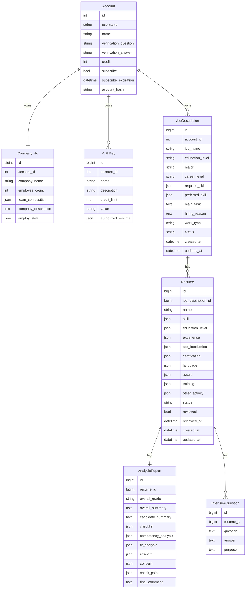

# 스키마와 ERD

DB 모델의 기준은 `backend/api/models.py`입니다. 마이그레이션 파일은 `backend/api/migrations/`에 있습니다.

## ERD

## 테이블 이름

| 모델 | 테이블 |
| --- | --- |
| `Account` | `users` |
| `CompanyInfo` | `company_info` |
| `AuthKey` | `auth_keys` |
| `JobDescription` | `job_descriptions` |
| `Resume` | `resumes` |
| `AnalysisReport` | `analysis_reports` |
| `InterviewQuestion` | `interview_questions` |

## 상태값

`JobDescription.status`:

- `prepare`
- `on_going`
- `closed`

`Resume.status`:

- `onqueue`
- `processing`
- `done`

프론트 표시 라벨은 `frontend/src/api/adapters.ts`에서 매핑합니다.

## 직렬화 규칙

각 모델은 `to_dict()`를 제공합니다.

- `None` 문자열 필드는 빈 문자열로 변환합니다.
- `None` list 필드는 빈 배열로 변환합니다.
- `None` dict 필드는 빈 객체로 변환합니다.
- `DateTime`은 ISO 문자열로 변환합니다.

근거: `_value_or_empty_string`, `_value_or_empty_list`, `_datetime_to_iso` in `backend/api/models.py`

## 관련 문서

- [백엔드 모듈](../04-backend/modules.md)
- [API 레퍼런스](../06-api/api-reference.md)
