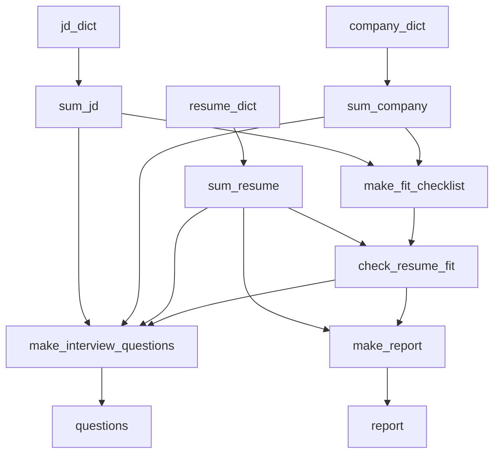

# 모델 파이프라인

## 지원서 분석 모델

위치: `backend/common/report.py`

모델:

- `MODEL_NAME = "gpt-4o-mini"` — `backend/common/report.py`

기본 생성량:

- 면접 질문: `QUESTION_COUNT = 10`
- 적합도 체크리스트: `CHECKLIST_COUNT = 10`

기본 DB 데이터:

- `Python/Java/Node, REST API, DB 설계, 인증/권한, 서버 배포 경험`

## 처리 단계

## 프롬프트 역할

`report.py`의 prompt 상수:

- `RESUME_SUMMARY_SYSTEM_PROMPT`: 지원자 핵심 역량/경험/학력 요약
- `COMPANY_SUMMARY_SYSTEM_PROMPT`: 회사 규모/조직/서비스/인재상 요약
- `JD_SUMMARY_SYSTEM_PROMPT`: 포지션 요건/업무/근무 형태 요약
- `FIT_CHECKLIST_SYSTEM_PROMPT`: 회사/JD 기준 체크리스트 생성
- `CHECK_RESUME_FIT_SYSTEM_PROMPT`: 지원서 요약과 체크리스트 충족 여부 판정
- `INTERVIEW_QUESTION_SYSTEM_PROMPT`: 질문/모범 답안/질문 의도 생성
- `REPORT_SYSTEM_PROMPT`: 최종 분석 리포트 생성

## 구조화 스키마

Pydantic 모델:

- `InterviewQuestionAnswer`
- `InterviewQuestionsStructure`
- `FitChecklistStructure`
- `ChecklistCheckItem`
- `ChecklistCheckStructure`
- `ReportStructure`

`_create_structured_completion()`은 OpenAI SDK의 parse 지원 여부에 따라 structured parse 또는 JSON object 검증을 사용합니다.

## 실험 버전과 평가

운영 API는 `report.py`만 import합니다. 근거: `backend/api/views.py`

| 모듈 | 용도 | 모델 | 비고 |
| --- | --- | --- | --- |
| `report.py` | 운영 파이프라인 | `gpt-4o-mini` | `resume_analize`가 호출 |
| `report2.py` | 프롬프트 수정 실험 | `gpt-4o-mini` | 환각 방지·면접 질문 구조 등 프롬프트 강화 |
| `report3.py` | `report2` 후속 실험 | `gpt-4o-mini` | `make_report()`에서 체크리스트 T/F 기반 등급을 코드로 확정하고 LLM 출력과 동기화 |

평가 노트북(`backend/common/eval/`):

- `middle_report_eval.ipynb` — 구버전 `report.py` 대비 Ver1/Ver2 평가
- `middle_report2_eval.ipynb` — `report2.py` end-to-end 평가
- `middle_report3_eval.ipynb` — `report3.py` end-to-end 평가
- `chat_eval.ipynb` — 채팅 파이프라인 평가
- `goldset_mock_data_fixed.csv` — 리포트 평가용 골드셋

노트북은 로컬 Jupyter에서 OpenAI API 키가 필요합니다. 결과 CSV는 노트북 내부 경로에 저장되며 운영 DB와는 분리됩니다.

## 채팅 모델

위치: `backend/common/chat_agent.py`, `backend/common/chat_graph.py`

모델:

- `LLM_MODEL = "gpt-4o-mini"`
- `TEMPERATURE = 0`

채팅 그래프 단계:

1. `fall_case_node`: 범위 밖, HR 데이터 질문, 앱 매뉴얼 질문을 분류합니다.
2. `context_extractor_node`: HR 질문에 필요한 이전 대화의 수치/값을 추출합니다.
3. `hr_analyst_node`: 접근 가능한 JD 데이터 기반으로 답변합니다.
4. `app_manual_rag_node`: Pinecone에서 앱 사용법 문서를 검색하고 답변합니다.
5. `summary_node`: 여러 답변을 하나로 병합합니다.

## 관련 문서

- [분석 파이프라인](../04-backend/analysis-pipeline.md)
- [검색과 저장소](retrieval-and-storage.md)
