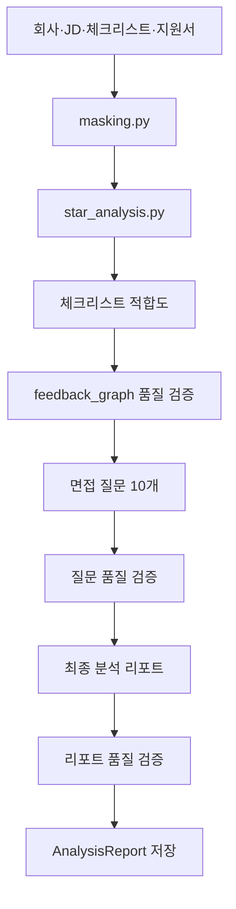

# 모델 파이프라인

운영 지원서 분석은 `backend/common/analysis_graph.py`의 LangGraph 파이프라인이 담당합니다. API 진입점은 `POST /api/resume/analyze/`, 저장 오케스트레이션은 `backend/api/tasks.py`입니다.

## 처리 흐름

- `analysis_agent.py`: 적합도, 면접 질문, 최종 리포트의 Pydantic 구조화 출력
- `analysis_prompt.py`: 프롬프트와 평가 기준, 파이프라인 버전 `1.0`
- `feedback_agent.py`, `feedback_graph.py`: 근거 데이터와 생성 결과를 비교해 최대 3회 보정
- `masking.py`: 회사·사람·학교·프로젝트 등 민감 식별자를 토큰화
- `star_analysis.py`: 자기소개서 문항을 STAR 구조로 정규화하고 원문 품질을 보존

## 모델과 실행 경로

- 분석·검증 기본 모델: `gpt-4o-mini`
- 면접 질문 생성 모델: `gpt-4.1`
- 마스킹·STAR: 해당 RunPod endpoint 환경 변수가 있으면 RunPod를 우선 사용하고, 없거나 실패하면 OpenAI 경로를 사용
- RunPod 배포 자산: `runpod/masking_handler.py`, `runpod/star_handler.py` 및 각 docker 파일

필요한 환경 변수는 `OPENAI_API_KEY`, 선택적으로 `RUNPOD_API_KEY`, `RUNPOD_MASKING_ENDPOINT_ID`, `RUNPOD_STAR_ENDPOINT_ID`입니다.

## 저장과 비용

`resume_analyze`는 분석 전 `AnalysisReport(status="onqueue")`를 생성합니다. 활성 구독자가 아니면 계정 또는 API 키에서 100 크레딧을 원자적으로 차감합니다. worker가 있으면 Celery에 위임하고, 없으면 동기로 실행합니다. 실패 시 상태를 `fail`로 바꾸고 차감분을 환불합니다.

저장 필드는 `version`, `overall_grade`, `overall_summary`, `candidate_summary`, `checklist`, `competency_analysis`, `fit_analysis`, `motive`, `collaboration`, `strength`, `concern`, `check_point`, `interview_question`, `final_comment`입니다. 사용자는 이후 `user_feedback`과 `review_text`를 저장할 수 있습니다.

## 학습과 평가 자산

- `llm/eval/`: 채팅, RAG, 리포트, 마스킹, STAR 평가
- `llm/train_star_masking/masking/`: 마스킹 모델 학습 실험
- `llm/train_star_masking/star/`: STAR 모델 학습 실험

노트북은 실험 자산이며 운영 Django 코드에서 직접 실행하지 않습니다.

## 관련 문서

- [분석 파이프라인](../04-backend/analysis-pipeline.md)
- [검색과 저장소](retrieval-and-storage.md)
- [지원서 분석 기능](../08-features/resume-analysis.md)
